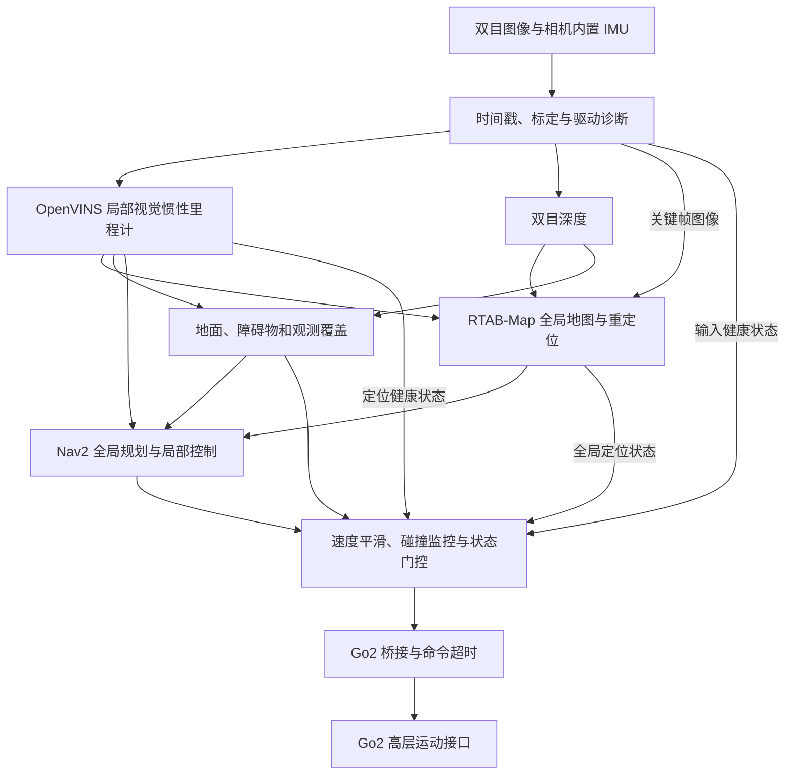

**Go2 双目惯性建图导航：独立评估与实施方案**

评估日期：2026-09-25。依据仅为本次明确给出的需求和本次查阅的官方资料，没有读取旧项目代码、配置、历史提交或记忆。本文是待硬件参数确认的工程方案，尚未进行相机实测、Go2 实测或 ROS 2 运行验证。

**一、目前能确定的结论**

已确认：一台彩色双目相机，左右目硬件时间同步，内置 IMU 与相机同源时钟，视频通过 UVC 输出，平台为 Go2，不依赖雷达。

尚未确认：全局或滚动快门、读出时间、基线、视场角、原生分辨率和帧率、IMU 型号和频率、时间戳协议、计算设备、系统版本、Go2 型号和控制权限、目标地形、速度、地图规模和精度要求。

双目加 IMU 足以构成有尺度的视觉惯性定位系统。是否能完成目标导航，还取决于障碍物深度、地面可观测性、视野覆盖和运动控制条件。任何算法选型都不能消除传感器完全看不到的区域。

在“平地或小起伏的可通行路面、前进为主、先人工建图再到点导航”的暂定范围内，推荐先实施：

**OpenVINS 双目惯性里程计 → RTAB-Map 全局建图与视觉重定位；双目深度 → 地面/障碍物/观测覆盖处理 → Nav2 → Go2 高层速度接口。**

同时加入独立的运行状态管理、指令超时和停车机制。这些是导航系统的组成部分。

这是默认实施顺序，不是已经证明的算法性能排名。如果目标包括自主上下楼梯、跨沟、落脚点选择或复杂越野，必须增加高程地图、可通行性与接触/落脚点规划，并重新确认 Go2 控制接口能否支持；本文的平面导航配置不能直接承担这些目标。

**二、算法选择依据与替换条件**

| 候选 | 经官方资料确认的能力 | 本项目中的判断 |
|---|---|---|
| OpenVINS | 基于 MSCKF 的视觉惯性估计；同步双目；ROS 2；静态和动态初始化 | 默认局部里程计。局部状态与全局地图分工清楚，便于单独验证定位、延迟和故障状态；不宣称其精度必然胜过优化式方法 |
| ORB-SLAM3 Stereo-Inertial | 双目惯性、回环、多地图；官方 ROS 示例基于 ROS 1 | 有力的定位/SLAM 候选，但 ROS 2 封装、连续局部里程计输出、地图重用与重置语义需要额外核实 |
| VINS-Fusion | 优化式双目惯性估计、可选回环、时空参数估计 | 技术上适合；原始官方工程基于 ROS 1，若没有既有且验证过的 ROS 2 实现，不把移植工作作为第一阶段的重点 |
| OKVIS2 | 优化式视觉惯性 SLAM、回环；当前官方工程已有 ROS 2 构建和订阅节点 | 作为优化式方法的优先对照候选。需要审查其图优化后轨迹更新和局部里程计/地图接口，不能把优化后的跳变直接送给控制器 |
| cuVSLAM / Isaac ROS | CUDA 加速视觉定位与 SLAM，支持双目和 IMU | 有兼容 NVIDIA 平台时加入对照；需按具体发行版确认平台和驱动支持，不能仅凭“有 Jetson”认定整套可用 |

以上能力来自 [OpenVINS](https://github.com/rpng/open_vins)、[ORB-SLAM3](https://github.com/UZ-SLAMLab/ORB_SLAM3)、[VINS-Fusion](https://github.com/HKUST-Aerial-Robotics/VINS-Fusion)、[OKVIS2](https://github.com/ethz-mrl/okvis2) 和 [Isaac ROS 官方资料](https://nvidia-isaac-ros.github.io/v/release-5.0/repositories_and_packages/isaac_ros_visual_slam/index.html)。最后一列是针对当前需求的工程判断。

首轮只实测两个候选：无 NVIDIA GPU 时比较 OpenVINS 与一个接入成本可接受的优化式候选，优先核查 OKVIS2；有兼容 GPU 时比较 OpenVINS 与 cuVSLAM。暂不同时集成五套系统。

选择依据按顺序为：有无未报告的错误位姿和重置、普通行走是否掉跟踪、端到端延迟及队列积压、局部运动误差、恢复/地图重定位成功率、资源占用。先要求满足任务，再比较精度。不同机器、不同配置上的论文数字不直接当作 Go2 上的排名。

也不能把“加 IMU”理解成所有实现都会提高精度。例如 cuVSLAM 官方说明，其 IMU 融合主要帮助短时视觉受阻时的鲁棒性，正常视觉条件下不保证提高精度。[cuVSLAM 官方排障说明](https://github.com/nvidia-isaac/cuVSLAM/blob/main/TROUBLESHOOTING.md#step-9-imu-integration)

**三、为什么采用局部里程计与全局地图分开的结构**

局部控制需要最近一段时间的连续运动；全局回环会修正累积误差。把全局修正直接叠进局部控制使用的里程计，会让机器人在控制器看来突然改变位置。

本方案让 VIO 维护局部运动，由 RTAB-Map 单独维护全局定位修正、回环和地图。RTAB-Map 官方支持外部里程计、双目建图、占据栅格输出；不需要使用它自带的里程计节点。[RTAB-Map 官方说明](https://github.com/introlab/rtabmap_ros/blob/ros2/README.md)

这是有代价的：两者可能分别提取视觉特征，带来额外算力。首先降低全局建图频率和选取关键帧；只有性能测量证明有必要时，才研究复用特征。不要为了省一次特征提取，一开始就深改两套算法。

全局回环只保留一个管理者；不同时让两个 SLAM 后端发布同一条全局 TF，也不把回环校正后的位姿重新当作独立传感器反馈给 VIO。

**四、先验证数据链路：UVC 能出图不等于 VIO 输入合格**

需要相机厂家提供或实测确认：

| 项目 | 必须弄清楚的内容 | 不满足时的处理 |
|---|---|---|
| 双目输出方式 | 左右拼接还是两个视频流；真实触发配对编号；是否固件已校正 | 在驱动层正确拆分和配对，不用人为改成相同时间戳掩盖错帧 |
| 图像时间戳 | 硬件时间戳单位、位宽、回绕；代表曝光开始、中点还是其他时刻 | 明确时间语义后统一映射；不可默认等于主机收到帧的时间 |
| IMU 接口 | 原始角速度/加速度从 HID、串口、扩展单元还是其他协议输出 | 单独实现/选取适配驱动；普通 UVC 视频节点未必包含 IMU |
| 相机—IMU 时间 | 同源时钟之外，是否存在曝光、滤波或固件导致的固定延迟 | 标定并验证偏移，不能直接假设为零 |
| IMU 数据 | 原始比力与角速度、单位、坐标轴、量程、噪声、内部滤波延迟 | 按算法要求输入，不先任意扣除重力或只提供姿态四元数 |
| 图像质量 | 快门方式、读出时间、曝光、左右亮度差、压缩与 ISP 处理 | 先检查实际行走图像，再决定算法和速度范围 |
| 数据完整性 | 图像错配/丢帧、IMU 缺段、重复包、到达顺序和排队延迟 | 报告并拒绝不完整区间；不要静默填补大段数据 |

Linux UVC 提供元数据接口，但设备是否提供所需字段、字段是否具有正确时间语义仍需验证。[Linux UVC 元数据文档](https://www.kernel.org/doc/html/latest/userspace-api/media/v4l/metafmt-uvc.html)

驱动设计要求：

1. 图像与 IMU 使用一致的硬件时间域到 ROS 时间域映射；必要时建模比例与偏移。不能分别用两路 USB 到达时间独立打戳。
2. 保留原始硬件计数、帧号和到达时间供诊断。公共 ROS 消息时间戳之外另记录诊断元数据。
3. 配对依靠真实触发关系。若硬件左右目时间本来一致，可使用精确同步；若协议给出固定相位关系，应明确处理，不能随意放宽软件匹配窗口。
4. VIO 按图像采集时刻使用对应的 IMU 区间，并按算法要求提供边界样本。不要把高频 IMU 简单降到视频帧率。
5. 时间回绕、断电重连、时钟跳变触发新会话或明确重置，暂停导航，重新初始化和定位。
6. VIO 图像流与建图关键帧可以不同频率，但输入队列必须有界；CPU 过载时先降低地图更新、显示和记录负载。
7. 接收到旧图像、旧点云时保留原始采集时间，不更新成当前时间。否则状态监控会把过期数据误认为实时观测。

**五、安装与标定需要交付什么**

相机和内置 IMU 保持刚性连接；相机到 Go2 机身也使用短而稳定的支架。减振结构如果允许明显相对运动，会破坏固定外参假设。安装后检查狗腿、自身机体和线缆是否进入视野，并为自身遮挡设置图像/点云掩膜。

视野需要同时覆盖前方障碍物和一定范围的地面。安装高度与俯角通过实测选择，不直接给出固定角度。必须画出最近可见地面、有效深度范围、左右侧盲区，以及转弯时身体扫过的区域。

至少产生以下标定与验证成果（名称为拟定交付物）：

| 成果 | 内容 |
|---|---|
| 双目标定文件 | 两目内参、畸变模型、左右相机外参、基线、校正矩阵 |
| 相机—IMU 标定文件 | 平移、旋转、时间偏移及其方向约定 |
| IMU 参数文件 | 噪声密度、偏置随机游走、量程、输出频率、滤波配置 |
| 机身外参文件 | 相机/IMU 到机身参考点的变换 |
| 独立验证报告 | 未用于拟合的数据上的重投影、极线、距离、姿态与时间一致性 |

使用 Kalibr 做相机与相机—IMU 时空标定；IMU 噪声用静态数据分析。标定采集应让各方向得到充分激励，而不是只沿直线运动。[Kalibr 官方相机—IMU 标定说明](https://github.com/ethz-asl/kalibr/wiki/camera-imu-calibration)、[OpenVINS 标定说明](https://docs.openvins.com/gs-calibration.html)

工程起点可把重投影误差约 0.3–0.5 像素作为复查指标，同时检查图像边缘误差、极线残差和已知距离。单个均方误差合格不证明外参、尺度和时间已经正确。

标定配置必须对应部署时的分辨率、裁剪、对焦和图像校正流程。缩放后修改内参；校正图像使用校正后的模型，不能再套原始畸变参数。优先固定经过验证的外参，按需要启用有限的在线时间偏移估计，不一开始开放所有标定参数共同漂移。

**六、深度与障碍物感知独立验证**

CPU 起点采用校正双目加 SGBM，并进行左右一致性、匹配唯一性和斑点检查。具体视差搜索范围由基线、焦距与所需最近距离决定。强滤波可能抹掉细杆或低矮障碍物，需要用实际障碍物验证。[OpenCV StereoSGBM 文档](https://docs.opencv.org/4.6.0/d2/d85/classcv_1_1StereoSGBM.html)

存在可用 NVIDIA 算力时，比较学习式双目深度，例如 Fast-FoundationStereo，判断其在目标硬件上的延迟、显存占用、弱纹理与边缘错误是否更适合。模型输出更完整不代表每个像素都有可靠几何依据，仍需无效区域与一致性处理。[Fast-FoundationStereo 官方实现](https://github.com/NVlabs/Fast-FoundationStereo)

双目距离关系为 `Z = fB/d`，小视差误差近似导致 `σZ ≈ Z²σd/(fB)`。这里 f 为像素焦距，B 为米制基线，d 为视差。

例如仅作计算演示：f=600 像素、B=0.10 米、视差误差 0.5 像素时，2 米处距离误差约 3.3 厘米，5 米处约 20.8 厘米。这不包含错匹配、标定误差和运动模糊，也不代表你的相机性能。有效避障距离必须测量。

实时感知分支执行：

1. 取得同一采集时刻的深度与姿态，变换到重力对齐坐标系。
2. 通过有重力方向约束的局部地面拟合/高度分析，区分地面和障碍物；不把最大平面无条件当作地面。
3. 保留低矮障碍物、细杆和机身高度附近的障碍物；阈值按机身与步态测量。
4. 输出障碍物观测、可靠可通行地面、未知区域和空间覆盖时间。
5. 无效深度、缺失地面、玻璃反光等保持未知；不把无返回解释成无限远自由空间。
6. 用局部地图保存短时观测，并随移动和观测时效增加不确定性。不能靠障碍物“到期删除”就认定该处可通行。

这部分需要一个薄的感知/可通行性适配层。Nav2 的标准 Voxel Layer 能接收三维点云并投影规划，但不会自动替你判断“前方缺少地面是否是下台阶”。需要额外把可靠地面和观测覆盖约束接入代价地图或路径执行门控。[Nav2 Voxel Layer](https://docs.nav2.org/rolling/configuration_and_development/configuration_guide/core_servers/costmap_2d/costmap_plugins/voxel/)

如果目标路线存在无法稳定识别的玻璃、黑暗、长段无纹理区域或落差，应改变运行范围/环境条件，或者重新讨论硬件约束；单靠修改 SLAM 参数不能保证解决。

**七、组件与数据接口**

以下是项目统一接口设计，并非各开源包的默认话题名称。后续通过 remap 或薄适配节点实现。

| 模块 | 输入 | 输出/职责 |
|---|---|---|
| 相机与 IMU 驱动 | UVC 与 IMU 协议 | 左右图像、CameraInfo、原始 IMU、时间与丢帧诊断 |
| 图像预处理 | 图像、标定 | VIO 图像与深度用校正图像；复用校正结果 |
| VIO | 双目、原始 IMU、标定 | 局部 6DoF 状态、速度、协方差、跟踪/初始化状态 |
| 里程计/TF 适配 | VIO 状态、机身外参 | `/odom` 与统一 TF；处理输出参考点和速度坐标系 |
| 双目深度 | 校正双目 | `/perception/depth`、有效性信息、点云 |
| 地面/障碍物/覆盖处理 | 点云、对应时刻姿态 | 障碍物、已观测可通行区域、未知区域与数据年龄 |
| RTAB-Map | 关键帧图像/深度、对应时刻里程计 | 地图数据库、全局栅格、全局定位修正 |
| Nav2 | 地图、定位、局部代价地图、目标 | 路径和候选速度 |
| 运行状态管理与指令门控 | 所有关键模块状态、人工接管、候选速度 | 允许/限速/停止；唯一有效控制链 |
| Go2 桥接 | 通过门控的速度 | 高层 Move/StopMove 请求、独立命令超时 |

建议主数据流：

不需要额外加入一个通用 EKF 来重复融合已经进入 VIO 的同一组 IMU 数据。若未来使用 Go2 的腿式里程计或其他状态源，需要先确认时间、参考系、相关性和误差模型；不能把厂商状态直接当作定位真值。

**八、坐标系与时间一致性**

采用 `map → odom → base_footprint → base_link → 传感器坐标系`。

| TF | 唯一发布者 | 约定 |
|---|---|---|
| `map → odom` | RTAB-Map 或经过审查的全局定位适配器 | 表达全局定位修正；不修改局部里程计历史 |
| `odom → base_footprint` | 里程计适配节点 | 局部水平位置与航向 |
| `base_footprint → base_link` | 同一个适配节点 | 保留机身高度、俯仰与横滚；随行走变化 |
| `base_link → imu_link/camera_link` | 静态 TF/机器人描述 | 来自刚性安装标定 |
| 相机结构坐标系到光学坐标系 | 静态 TF/机器人描述 | 明确光学轴与 ROS 机身轴的差异 |

`base_footprint` 是平面导航投影参考系，不代表仅凭 VIO 已经精确知道实时足底接触平面。平地启动时要建立地面高度参考；地形显著变化时需要地面/高程估计。

VIO 默认 TF 与适配节点不能重复发布同一对象。相机/IMU 位置转成机身位置时包含完整外参；速度转换要考虑参考点偏移和旋转，不能只改 frame_id。

RTAB-Map 配对图像与该图像采集时刻的局部位姿。控制可使用预测到当前时刻的局部状态，但不能把当前预测位姿直接配给旧图像。点云变换也必须查询采集时刻的 TF。

**九、建图、地图保存与再次导航**

首次建图采用人工遥控，系统记录数据并建图。路线应覆盖出入口、交叉路口、双向行走时的不同观察方向，并形成可验证的回环。不要假设正向采集的图像足够支持从背面返回时的视觉定位。

保存三类成果：视觉地图数据库、导航栅格地图、与之配套的标定和版本清单。只有栅格图片与 YAML 通常不够恢复视觉重定位所需的信息。

运行流程分开管理：

1. 建图模式：允许新增关键帧与地图优化，记录地图质量问题。
2. 地图检查：检查墙面重影、尺度、重复走廊错误回环、障碍高度和未知区域；必要时基于优化后的关键帧重建栅格。
3. 导航模式：加载验证过的地图，启动新局部里程计，完成视觉重定位后才允许接收运动目标。
4. 定位恢复：失去可信全局定位时暂停任务；局部 VIO 尚正常也不等于仍知道全局目标位置。恢复后检查一致性并重新规划。

地图中的临时行人/物体不应长期成为静态结构。实时局部感知始终运行，避免仅依赖旧地图。环境改动较大时采用显式重建/更新流程，避免无人监管地覆盖已经验证的地图。

**十、Nav2 与 Go2 的具体导航方案**

全局规划优先考虑 **Smac State Lattice**：Go2 的机身和腿部活动包络不是圆形，它能在位置与航向空间内检查足迹。运动基元限制在经过验证的前进与转向范围；原地旋转只有扫掠空间已确认可用时才开放。若首轮在宽阔区域验证，可使用保守外接圆配合 Smac 2D 降低集成成本，但会牺牲窄门通行能力。[Nav2 Smac 规划器说明](https://docs.nav2.org/rolling/configuration_and_development/configuration_guide/planners_plugins/smac/)

局部控制使用 **MPPI**。首版只允许前向速度与航向角速度，采用对应的平面运动模型；这只是高层速度模型，不是重写 Go2 腿部控制。侧向运动只有在侧向感知覆盖与机体响应通过验证后，才切换到 Omni 并开放横移。[MPPI 官方说明](https://github.com/ros-navigation/navigation2/blob/main/nav2_mppi_controller/README.md)

代价地图与动作配置：

- 全局：验证过的静态地图、需要的实时障碍更新、膨胀层；未知区域不直接作为可通行区域。
- 局部：以 `odom` 为参考的滚动代价地图，三维障碍观测与地面/覆盖约束，再做足迹碰撞检查。
- 足迹：覆盖机身、相机突出部分和当前步态的腿部摆动范围；额外留出定位与控制误差余量。
- 清除：仅由可靠观测支持的射线/地面证据清除障碍与未知，不能用被过滤掉的无效深度伪造自由空间。
- 恢复行为：禁用默认自动后退；自动旋转也必须经过扫掠区域可用性检查。默认失败动作是停止、等待有效观测或人工接管。
- 指令链：Nav2 → 限速/平滑 → Collision Monitor → 运行状态门控 → Go2 桥接。所有自动控制输入走同一条链。

Collision Monitor 可在规划器之外限制速度，并有传感器超时停机配置；但它仍依赖输入传感器，无法发现摄像头没有观测到的障碍物。[Nav2 Collision Monitor 文档](https://docs.nav2.org/jazzy/configuration_and_development/configuration_guide/core_servers/collision_monitor/configuring_collision_monitor_node/)

Go2 使用厂商高层运动接口，桥接前向/侧向/转向速度，保留原有步态与平衡控制。官方 SDK 提供 `Move(vx, vy, vyaw)` 与 `StopMove()`；实际型号和权限仍需实机确认。[Go2 官方接口](https://github.com/unitreerobotics/unitree_sdk2/blob/main/include/unitree/robot/go2/sport/sport_client.hpp)

**十一、速度由有效观测与实测制动决定**

首轮受控平地试验可从 0.2 m/s 前进速度开始；这只是拟议调试起点，不是已证明的安全上限。角速度要同时受图像清晰度、跟踪成功率和侧向扫掠空间限制。

对直线接近静止障碍物的简化工况，至少满足：

`d_free > v × T_total + v² / (2 × a_brake) + margin`

其中 d_free 从机器人前缘沿可执行路径计算；T_total 包含曝光、传输、深度计算、规划、通信和执行的延迟；a_brake 使用实测的保守减速度；margin 覆盖几何、定位、控制误差与观测盲区。对移动障碍物、转弯、坡面需要单独评估，不能用这个公式直接作保证。

测量 Go2 的指令响应滞后、停止距离、稳态速度误差与转弯包络，再设置控制器的速度和加速度限制。不能把 SDK 能接受的最大速度直接作为导航速度。

前向双目存在近距离、侧方与后方盲区。局部地图可以保存近期观测，但不能保证背后没有新进入的人。第一版的运行范围应限制这些未观测运动，并明确启动与转向所需的已确认净空。

**十二、运行状态管理与故障处理**

拟实现以下状态：等待传感器、VIO 初始化、等待地图定位、就绪、导航、降速、停车、等待恢复、人工接管。

| 事件 | 系统动作 |
|---|---|
| 图像停止、IMU 缺段、硬件时间跳变 | 禁止继续输出导航速度；必要时重新初始化 |
| VIO 输出重置、非有限数、错误尺度或明显不合理跳变 | 停止任务，保留故障前后数据，重定位后重新规划 |
| 深度持续更新但有效观测不足 | 视为感知失效，而不是“前方没有障碍” |
| 地面缺失/未验证区域进入即将行走的包络 | 停止或重规划，不自动进入未知区域 |
| 全局定位置信不足或疑似错误回环 | 暂停全局目标执行；确认地图对齐后再恢复 |
| 数据延迟超过运动预算 | 降速或停车，优先释放显示、建图和日志负载 |
| 导航进程/门控进程退出 | Go2 桥接独立命令超时；停止运动 |
| 主机断网或桥接退出 | 必须实测机器人侧失联行为；依赖主机继续发送 StopMove 无法覆盖该故障 |
| 人工接管 | 撤销自动控制权，避免多个速度发布者竞争 |

“节点活着”或“话题还有频率”不足以证明状态有效。门控还要检查数据年龄、跟踪状态、有效深度比例、空间覆盖与变换有效性。正常停止使用经验证的停止运动流程，不能把切到阻尼/取消支撑当作普通停车。

保留环形故障日志：原始时间信息、图像、IMU、位姿、定位状态、深度有效性、TF、候选/实际指令及故障原因。故障发生后冻结前后数据，保证问题可复现。

**十三、计算平台、系统版本与运行预算**

不能从“Go2”推断已有足够算力。如果实际上没有可运行这些软件的计算主机，需要先补齐计算平台；这与是否增加雷达是两件事。

关键闭环建议放在随机器狗移动的计算设备上，通过本地 USB 采集和有线链路发送控制。远端工作站适合可视化、日志分析与离线标定，持续导航不要依赖不确定的无线往返时延。

CPU 默认路线先检查 Ubuntu 22.04 / ROS 2 Humble 的兼容组合，因为 Unitree 官方当前将其列为推荐的已测试配置。新系统若选择 Ubuntu 24.04 / Jazzy，则把相机驱动、VIO、Unitree 通信和导航依赖一起验证，不假设全部支持。最终冻结版本、提交号与依赖清单。[Unitree ROS 2 官方环境说明](https://github.com/unitreerobotics/unitree_ros2#system-requirements)

GPU 路线按具体 JetPack/CUDA/Isaac ROS 版本匹配，不能直接套用最新网页的参数到旧发行版。当前 Isaac ROS 文档存在发行版与包名称变化，部署时使用固定版本文档。[Isaac ROS 发行版资料](https://nvidia-isaac-ros.github.io/v/release-5.0/repositories_and_packages/isaac_ros_visual_slam/index.html)

以下仅为初始性能目标，必须在目标设备上测量：

| 环节 | 初始目标 | 取舍依据 |
|---|---|---|
| 双目输入 | 原生模式 30–60 Hz，硬件允许时优先清晰且稳定的模式 | 稳定帧间位移、曝光与 USB 带宽共同决定 |
| IMU | 约 200–400 Hz 或合适的硬件原生频率 | 保留真实样本，不人为插值成“更高规格” |
| VIO | 处理每个选定输入帧，及时提供控制所需状态 | 不能靠队列越积越长维持表面处理成功 |
| 深度/局部感知 | 10–20 Hz 起评 | 根据速度、制动距离与实际观测延迟调整 |
| 地图更新 | 关键帧约 1–2 Hz 起评 | 优先留出实时感知和控制算力 |
| 局部控制 | 20 Hz 起评 | 联合测量底盘响应与实际计算预算 |
| RViz/可视化 | 低优先级，必要时远端或关闭 | 不应挤占关键闭环资源 |

VIO 与深度不必使用同一分辨率；VIO 可以在满足特征质量的前提下降采样，深度分辨率由目标距离误差决定。记录 P50/P95/P99 延迟、掉帧、队列长度、温度降频、CPU/GPU 和磁盘负载。长时间全链运行结果比单节点离线帧率更有意义。

**十四、分阶段执行与验收**

下列数值是拟议的首轮工程门槛，尚不是对你的硬件的性能承诺；应在目标速度、通道宽度和定位精度明确后收紧或调整。

| 阶段 | 执行动作 | 可审查成果与进入下一阶段的条件 |
|---|---|---|
| 0：需求与接口 | 确认场景、算力、相机规格、Go2 权限、速度和成功标准 | 硬件/接口清单；确定能获取原始图像、原始 IMU 和可验证时间信息 |
| 1：数据链路 | 连续采集至少 5 分钟，含静止、缓慢旋转、实际行走；记录硬件帧号和时间统计 | 无未处理的时间回退、错帧或 IMU 缺段；采集不会持续积压 |
| 2：标定 | 双目、相机—IMU、机身外参、IMU 参数；使用独立数据验证 | 标定文件、版本、误差图、已知距离校验；问题不能靠后端滤波掩盖 |
| 3：VIO 对照 | 固定同一组数据和标定，逐个运行两个候选；局部误差比较时关闭全局回环修正 | 普通路线无未报告重置；反复启动可初始化；不持续积压；误差满足用途 |
| 4：深度/地面 | 在有效量程内测试墙、低矮箱体、细杆、纹理少的地面、反光/无返回区域 | 需要避让的障碍物可稳定观测；无效数据保持未知；身体俯仰不把地面变成障碍墙 |
| 5：地图闭环 | 人工建图，重复经过相似走廊；保存后完全重启，在多个位置和朝向定位 | 无已发现错误回环；地图可重用；加载失败或定位未确认时禁止运动 |
| 6：底盘与停车 | 测速度阶跃、转弯、停止距离、指令超时和人工接管；故障注入先台架后受控低速 | 速度模型和停止距离可重复；所有已列失效都有确定动作，包括失联 |
| 7：闭环导航 | 宽阔静态场景开始，再加入拐角、较窄通道、动态障碍；持续全链运行 | 记录到点误差、碰撞/人工干预、定位恢复、延迟；不能仅凭一次成功判断完成 |

VIO 数据集至少包含：桌面静止、缓慢六自由度运动、机器狗站立、起步、直行、左右转弯、启停、走廊、光照变化、短时遮挡、自身遮挡和目标环境中的弱纹理片段。每类关键工况至少重复三次，另留一组未参与调参的数据。

没有外部轨迹真值时，不报告伪造的 ATE/RPE。可测已知长度、指定检查点、原地转向误差和关闭回环后的往返终点偏差。首轮可把已知路段尺度误差约 2% 以内作为初始检查目标，但终点误差小不能证明整条轨迹正确。

导航精度验收与环境净空关联：机器人包络、局部定位误差、地图误差和跟踪误差的总余量必须小于通道可用净空。深度验收在多个距离和光照下检查漏检与假自由空间，而不只看平均深度误差。

每一阶段失败，先回到该阶段输入与模型定位原因；前级不合格时不通过增加滤波器、放宽阈值或强制二维约束让后级“看起来能跑”。

**十五、常见失败与根因排查顺序**

| 现象 | 优先检查 |
|---|---|
| 手持正常，上狗就失败 | 曝光模糊、振动、滚动快门、IMU 饱和、安装挠动、自身遮挡 |
| 纯视觉正常，加 IMU 更差 | 时间偏移符号、陀螺单位、加速度是否已去重力、相机—IMU 外参方向、内部滤波延迟 |
| 直行正常，一转弯就散 | 时间对齐、滚动快门、曝光、旋转时图像位移与特征分布 |
| 轨迹正常，地图墙面重影 | 图像与位姿时间配对、尺度、深度偏差、外参、回环后的地图更新 |
| 地面随步态变成障碍 | 点云是否用完整姿态和对应时刻 TF；地面高度参考是否正确 |
| 回环时控制突然跳动 | 是否把优化后的全局位姿作为局部 odom；是否重复发布 TF |
| 频率正常但越跑越慢 | 队列积压、DDS 传输、解码、记录磁盘和可视化负载 |
| 空点云时仍然继续走 | 把“没有有效观测”错误解释为“没有障碍” |
| 进程崩溃后继续运动 | 指令只有主进程看门狗，或机器人侧超时行为未经确认 |

**十六、接下来需要确认的信息**

1. 相机型号/厂家资料；快门、基线、视场角、分辨率/帧率、IMU 频率、硬件时间戳和原始 IMU 接口。
2. 计算设备的 CPU、GPU、内存和系统版本；是否已有随机器狗移动的计算主机。
3. 主要场景与最困难工况；是否必须自主上下楼梯或越野。
4. Go2 型号、固件与可用的速度控制/状态接口。
5. 期望速度、单次路线长度、定位/到点误差、人工建图或自主探索、无人值守要求。

这些信息齐全后，才能把方案变成真实可启动的驱动选择、固定软件版本、标定格式、launch、YAML、导航足迹与停车阈值。当前不编造相机标定、不承诺未知算力下的实时性能，也不把未经实测的配置称为完成部署。
