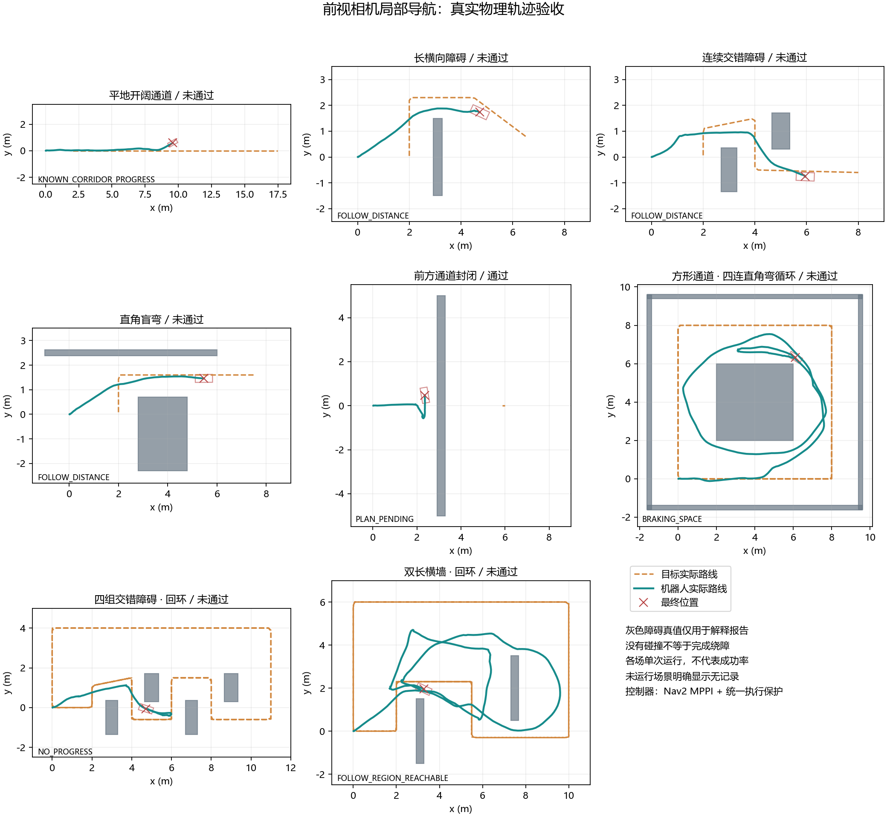
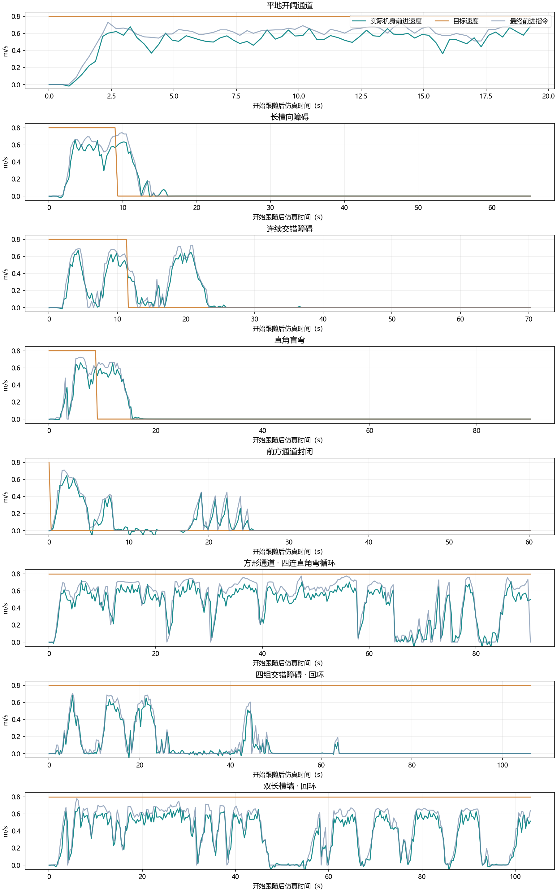

# 0.8 m/s 多场景完整跟随验收（2026-10-05）

**当前版本未达到人的持续移速0.8 m/s下流畅跟随避障的要求。** 八场全部实际运行：封闭通道停车通过；其余七个可通行场景均未通过流畅性，三个回环也未完成机器狗要求的两圈。各场都未记录到物理障碍接触。

批次：`navigation-full-08-20261005-232723`。这次保留当前导航实现和原验收门槛，只增加只读证据审计、运行记录和本文件。旧0.5 m/s成绩没有充当本轮结果，也没有改写本轮失败成绩。

## 运行配置与判定

- WSL Ubuntu-22.04、MuJoCo物理闭环、ROS 2 Humble Nav2 MPPI；没有进行ROS编译。
- 人的设置速度0.8 m/s；狗前进命令上限0.8 m/s、角速度命令上限1.0 rad/s；机身矩形长0.70 m、宽0.32 m。
- 执行模式`rate`、规划模式`annulus`、观察模式`cone`、执行器唤醒`steady`、搜索方式`process`。即当前默认的跟随距离区域、滚动地图局部搜索、MPPI跟踪和统一执行保护。
- 五个基础场景与三个两圈回环，总计603秒预定路线采样，另有起立、场景准备和深度/UWB中断检查。
- 开阔直行稳态实际速度至少0.72 m/s；绕障移动期间平均实际vx至少0.56 m/s。移动窗口最大间距小于3.5 m、低速时间占比不超过15%、最长连续低速不超过2 s。
- 低速指`abs(vx)<0.05 m/s`，部分低速区间仍在转向。移动统计排除起步前两秒及人到终点之后的静止期；开阔稳态另排除前八秒。表中的最大间距沿用原报告的移动窗口字段，并非末帧距离。
- 循环场景要求人和狗都完成两圈；狗的圈数由实际位置依次通过路段截面和返回起点判定，人走完两圈不能替代狗的完成度。

## 本轮实测

| 场景 | 移动期间平均实际vx | 低速占比 | 最长低速段 | 移动窗口最大间距 | 人/狗圈数或任务 | 整体结果 |
|---|---:|---:|---:|---:|---|---|
| 开阔直行 | 0.551 m/s | 0.0% | 0.00 s | 7.84 m | 有前进，但持续掉队；稳态0.559 m/s | 未通过 |
| 长横墙 | 0.493 m/s | 0.0% | 0.00 s | 3.69 m | 最终完成绕障；行走期间速度和间距不达标 | 未通过 |
| 基础连续交错 | 0.367 m/s | 5.7% | 0.53 s | 5.10 m | 最终完成绕障；行走期间掉队 | 未通过 |
| 基础直角盲弯 | 0.412 m/s | 4.1% | 0.28 s | 5.10 m | 最终通过弯道；行走期间掉队 | 未通过 |
| 封闭通道 | 不适用 | 不适用 | 不适用 | 不适用 | 墙前末段稳定停车 | 通过停车任务 |
| 方形四连弯回环 | 0.451 m/s | 8.4% | 1.54 s | 8.04 m | 人2圈 / 狗1圈 | 未通过 |
| 四组交错回环 | 0.078 m/s | 77.6% | 42.14 s | 7.42 m | 人2圈 / 狗0圈 | 未通过 |
| 双长横墙回环 | 0.363 m/s | 17.3% | 6.70 s | 6.44 m | 人2圈 / 狗1圈 | 未通过 |

基础安全检查八场均通过：无障碍接触、姿态就绪、指令在边界内、MPPI服务存活，以及输入中断后的命令归零。MPPI服务存活不等于每个跟踪动作成功；有限路线结束后有些中断检查发生在静止阶段。这些检查没有证明0.8 m/s实机的制动距离。

自动脚本最终返回失败码，是七场未达标的正常验收结果。全部八场的报告和样本均保存完成，不是环境启动失败。

## 已有证据支持的判断

**开阔直行存在速度供给不足和执行误差。** 稳态窗口的平均阶段限速0.792 m/s，MPPI原始输出0.634 m/s，最终前进命令0.635 m/s，实际vx为0.559 m/s。此处没有障碍、没有长时间低速，仍会掉队；因此需要分别量测MPPI速度选择、参考路径长度及步态的命令响应，不能把原因全部归给安全净空。

**交错回环存在跟踪动作中止及恢复失败。** 按开始跟随后时间：约26.61–42.93 s低速16.32 s，包含观察、转向和等待；约48.69–63.06 s再低速14.37 s；约63.97 s以后连续低速42.14 s，其中`NO_PROGRESS`约39.23 s。约49、53、58 s的样本均记录MPPI动作结果状态6，已用本机`action_msgs.msg.GoalStatus.STATUS_ABORTED`核对。约53 s缓存年龄仅0.05 s，却仍因动作无效进入`CONTROLLER_STALE`。该状态名同时覆盖动作失效和数据过期，不能单凭名字判断是回调超时。

完整因果链还缺MPPI内部中止原因。Nav2原生日志在每次启动时覆盖，本轮只保留了最后一场双长墙的原生日志；交错场景有逐样本动作状态，但不能据此断言它因哪一项代价或碰撞检查中止。下一轮应在复现该场前保存独立的Nav2日志、动作结果详情和相应地图/参考路径。

**双长墙在目标回返时仍有速度衔接问题。** 约47.82–54.52 s连续低速6.70 s，混合了路径跟随低速、近距离保护和控制器等待；其中约2.14 s实际仍在转向。不能把整段都称为原地停车。采样中的最大最终前进命令变化率约2.93 m/s²，包含保护归零；它是命令变化率，不是实机加速度测量。

**持续0.8 m/s需要追赶余量。** 即使狗能准确执行0.8 m/s命令，人在同向直行段也持续0.8 m/s时，狗转弯减速之后没有额外直行速度追回距离。下一轮应先解决速度输出与动作恢复，再评估狗的可靠追赶能力、目标自然转弯减速以及允许的跟随距离变化。

## 查看结果

[离线交互回放](navigation-full-08-20261005-232723-验收回放.html) 可以自己双击打开，切场景、拖动时间、播放与调倍速；不需要启动仿真。内嵌八场样本、场景快照和通过标志已与原报告核对。

本轮浏览器安全策略拒绝了自动导航到`file://`本地HTML文件。没有绕过该限制，也没有声称自动检查过回放按钮。下面两张静态图已经查看核对；它们使用同一批实际样本。





灰色障碍和人的预置路线是解释报告的真值，未作为导航器的全局已知地图或人的未来轨迹输入。当前D435i是几何近似，定位采用仿真真值，UWB未包含真实NLOS与多径；目标折线顶点也没有自然转弯的完整动力学。本轮为每场单次仿真验收，不代表重复成功率或RK3588实机性能。

## 自行复测、启动与停止

先结束正在人工验收的实例；自动检查不会接管其他实例。在Windows PowerShell运行完整八场：

```powershell
& 'C:\Users\chy\Documents\ChatGPT\go2_slam 2\sim_env\Check-NavigationDemo.ps1' -Speed 0.8 -Laps 2 -Scenarios open,long_wall,consecutive,corner,blocked,square_loop,slalom_loop,wall_loop -ReportPrefix navigation-self-full-08
```

脚本自动安装源码并逐场启动、采样和关闭，报告复制到`sim_env\artifacts`；失败也会保留成绩并关闭。重复使用同一前缀时，WSL原报告会另存历史。需要明确区分批次时自行换前缀。

人工查看实时效果：

```powershell
& 'C:\Users\chy\Documents\ChatGPT\go2_slam 2\sim_env\Start-FollowDemo.ps1'
```

打开`http://127.0.0.1:8765/`，选择并载入场景；姿态就绪后，在暂停状态确认起始周围1.2 m净空，再点击“开始 / 恢复跟随”和“目标沿场景路线行走”。人的默认速度是0.8 m/s。

人工验收结束后关闭：

```powershell
& 'C:\Users\chy\Documents\ChatGPT\go2_slam 2\sim_env\Stop-FollowDemo.ps1'
```

生成自行复测批次的回放：

```powershell
wsl.exe -d Ubuntu-22.04 -u chy --exec bash -lc 'source ~/go2_sim/follow_demo/setup.bash; cd ~/go2_sim; python -m follow_demo.tests.render_follow_replay --prefix navigation-self-full-08'
```

从`\\wsl.localhost\Ubuntu-22.04\home\chy\go2_sim\artifacts`复制生成的HTML，再自行双击打开。

## 证据与版本存档

- [八场来源和运动审计](navigation-full-08-20261005-232723-evidence-audit.json)：`evidence_valid=true`，八场26个源码摘要一致；`all_navigation_passed=false`，整体通过1/8。来源有效与导航达标分别记录。
- [回放内嵌数据核对](navigation-full-08-20261005-232723-replay-data-check.json)：八场数据与判定匹配，浏览器按钮自动检查明确标记受阻。
- [交错关键时刻记录](navigation-full-08-20261005-232723-slalom-diagnostic-timeline.json)：保留中止状态、命令年龄、实际运动和目标位置。
- 原始文件按`navigation-full-08-20261005-232723-场景ID.json`与`-samples.json`保存；CSV、调度日志和整轮终端输出见同前缀的`-raw-logs`目录。
- [源码与脚本存档清单](navigation-full-08-20261005-232723-source/archive-manifest.json)：72个源码文件、环境锁及启动/停止/验收脚本。两个ZIP均保留工作区相对目录，解压前先确认目标位置和现有文件。基础环境仍按上一级README复现。
- [退出检查](navigation-full-08-20261005-232723-cleanup.json)：HTTP8765不可达，仿真和Nav2进程不存在；搜索PID541、736、963、1212、1450、1713、1988、2403全部退出，最后的WSL启动进程22172退出。

本轮运行的测试、仿真和子进程全部已关闭。离线图表和HTML文件保留给用户验收，没有替用户确认产品达标。
