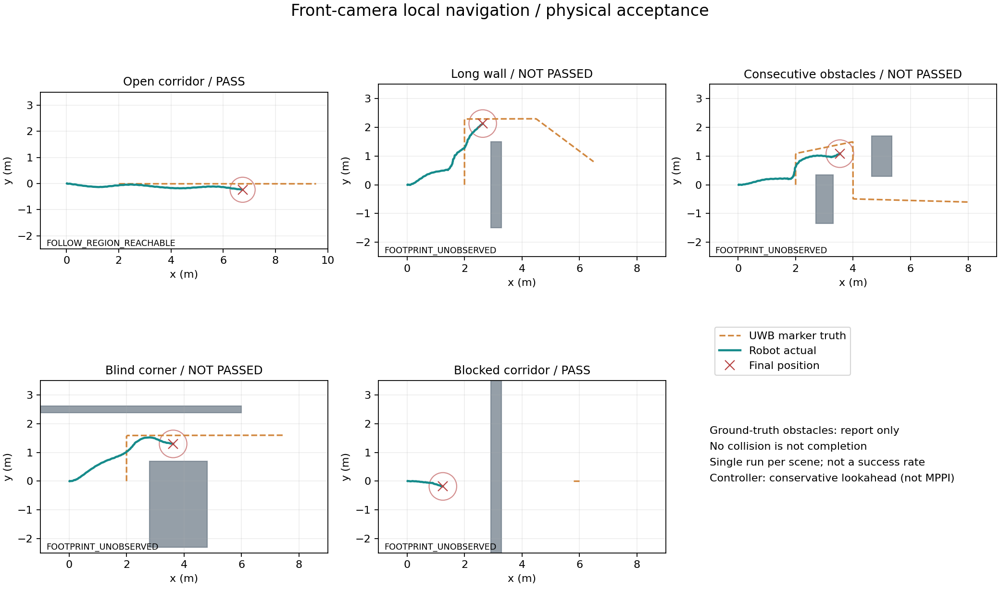

# 平地有限视野局部规划验收记录

**结论：感知、局部搜索和停车保护已接入物理闭环；复杂绕障的完成度未通过。当前不能宣称达到“像真狗一样平滑跟随并避障”。** 可交付的是供人工观察、复现问题的仿真原型。当前跟踪器是保守前视跟踪，尚未接入 MPPI。

## 本轮实现

- 前视理想深度经采集时刻 TF 投影到滚动地图，明确区分未知、自由、障碍和机身包络可通行区。
- 将 UWB 目标转换为可达跟随区域；一次 Dijkstra 比较多个目标，跟随区域不可达时搜索已知区域内的观察位置。
- 路径控制、观察、绕行和等待统一管理。目标偏角不能越过路径规划强行触发对人旋转。
- 分阶段限速、速度平滑和停车轨迹校验；前进受限时保留经检查仍安全的转向。规划比执行边界多留 0.12 m 净空。
- 五个静态场景、地图/路径/停车预测可视化、故障注入、真实运动采样、源码哈希和自动关闭检查。

未改动原步态策略，未处理低速死区和起步响应。未构建或编译 ROS 包。

## 物理检查结果

运行条件：Windows/WSL Ubuntu 22.04，ROS 2 Humble，MuJoCo + ONNX 关节力矩闭环；目标速度 0.25 m/s。下表取各场景最后一次检查，时长为主运动检查时长，不含初始化和输入中断检查。位移是起终点直线距离，不是累计路程。

| 场景 | 时长 | 实际位移 | 最终位置 x/y（m） | 接触采样 | 场景目标 |
|---|---:|---:|---|---:|---|
| 开阔通道 | 30 s | 6.73 m | 6.74 / -0.24 | 0 | 通过：沿通道前进 |
| 长横向障碍 | 65 s | 3.38 m | 2.63 / 2.13 | 0 | **未通过**：到达障碍端点附近，未绕到远侧 |
| 连续交错障碍 | 70 s | 3.69 m | 3.54 / 1.08 | 0 | **未通过**：停在第二个障碍前 |
| 直角盲弯 | 90 s | 3.83 m | 3.62 / 1.30 | 0 | **未通过**：进入转弯通道，但未走完整段 |
| 封闭通道 | 60 s | 1.25 m | 1.25 / -0.18 | 0 | 通过最低停车目标；不是绕行恢复通过 |

三个绕障失败场景最后均进入 `FOOTPRINT_UNOBSERVED`，命令归零。封闭通道也因该条件停住，并非已经证明能区分“真正无路”和“观察暂时不足”。此前 35 s 封闭通道检查仍在观察，延长到 60 s 后才验证最终停止。

五个场景的姿态、命令分阶段上限、深度中断命令归零、UWB 中断命令归零均通过。实际最终速度单独保存在报告中，不能用零命令替代制动距离证明。接触计数来自 100 Hz 物理状态快照，不是连续时间零碰撞证明。



图中青线为实际机器人运动，橙色虚线为目标真值路线，红叉为检查结束位置，圆圈为仿真机身包络。灰色障碍来自场景真值，仅用于离线解释结果，未作为导航输入。单轮结果不代表成功率；渲染、ROS 与物理线程按墙钟调度，同一源码的不同运行也会有差异。

## 已定位的限制及下一步顺序

1. **空间可达不等于执行期间始终可观察。** 地图自由观测保留 30 s；搜索使用当前可通行区，没有把每段预计到达时间与相关栅格剩余有效时间一起规划。慢速转弯、侧后方进入近场盲区和实际步态偏移，会使包络检查失效。此时停车是正确的保护，但不能当作绕障成功。
2. **观察目标缺少完整的时间调度。** 目前用未知空间收益和通行代价选择观察位置，还不能保证在近身净空到期前完成必要的重新观察。应先补充包络有效期诊断、可完成的观察转向与路线连续性，再按真实执行进展更新计划；无法刷新时提前减速或等待。
3. **不能用放宽未知区或延长 TTL 来掩盖失败。** 未知区仍禁止行驶；不通过读取墙后场景真值补图，也不反复人工确认途中净空。当前 30 s 已是静态仿真假设，不能直接用于有人穿行的实机环境。
4. **MPPI 放在这些问题之后接入。** 先用同一组场景验证观察调度与路径完成度，再替换跟踪器并比较轨迹、转向振荡、加减速与实际停车距离。仅更换跟踪器不能恢复相机没有观察到的空间。

本轮最大单次规划耗时约 104 ms，仅为本机测量，不能换算为 RK3588 性能。控制和传感器桥仍共用执行器，后续需要测量回调阻塞与端到端延迟。

## 其他验证与证据

- [纯逻辑检查日志](../logs/navigation-unit-check.log)：21 项通过，包含未知区、后方目标、观测过期、长墙路径、制动空间和输入中断。
- [ROS 接口记录](navigation-ros-check.json)：7 项接口检查通过，31 对同步双目；深度/内参与双目采集时间一致。该记录来自本轮较早的接口检查，之后接口实现未修改；不把它作为复杂绕障成功证据。
- `navigation-open.json`、`navigation-long_wall.json`、`navigation-consecutive.json`、`navigation-corner.json`、`navigation-blocked.json`：判定、最终位置、规划耗时、输入丢失响应及源码 SHA256。
- 同名 `-samples.json`：实际位置、速度、命令、路径和原因代码，便于分析失败位置。
- 五份物理报告中的 7 个核心文件哈希一致，并与交付源码核对相符。
- 新增的 `Check-NavigationDemo.ps1` 已实际验证已有服务拒绝检查和单场景启动/检查/复制/关闭全过程。五场景由同一 Python 检查器逐一运行。
- [关闭核查](navigation-shutdown-check.json)：HTTP、仿真与检查进程均退出；未结束整台 WSL 或其他任务。

## 人工验收

1. 双击上一级 `Start-FollowDemo.cmd`，打开 <http://127.0.0.1:8765/>。
2. 选择场景并载入；等待姿态就绪，在暂停状态确认起始周围 1.2 m 净空。
3. 点击“开始 / 恢复跟随”，再点击“目标沿场景路线行走”，速度先用 0.25 m/s。
4. 同时观察真实运动、地图黄色路径、紫色停车预测和停止代码。先看开阔跟随，再复现三个未通过场景；不要把停住误解为已绕过障碍。
5. 结束后双击 `Stop-FollowDemo.cmd`。关闭浏览器标签页不会停止仿真。

完整参数、原理和环境更新步骤见 [中文 README](../follow_demo/README.md)。自动运行全部场景：

```powershell
& 'C:\Users\chy\Documents\ChatGPT\go2_slam 2\sim_env\Check-NavigationDemo.ps1'
```

仅重画已有采样、不启动仿真：

```bash
source ~/go2_sim/follow_demo/setup.bash
cd ~/go2_sim
python -m follow_demo.tests.render_navigation_report
```

## 适用范围

仅平地静态箱体障碍。D435i 是名义几何近似加理想深度，安装外参待测；定位用仿真真值。虚拟 UWB 人体标记没有实体碰撞和深度遮挡；未实现多人、真实 NLOS、动态障碍预测、CAPO/VIO 定位替换或实机安全验收。
