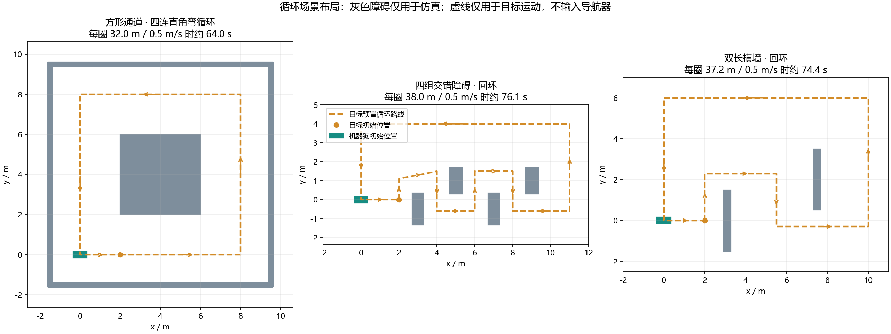

# 循环场景搭建与验收（2026-10-05）

本轮扩展仿真刺激、界面与验收方式，保留原来五个基础场景，不改导航控制器、观察策略及安全限速。相机仍为D435i前视几何近似；机器狗矩形长0.70 m、宽0.32 m，前进指令上限0.8 m/s，角速度指令上限1.0 rad/s。按随后用户指令，当前人的默认速度已设为0.8 m/s；本文历史物理成绩仍为0.5 m/s，不代表0.8 m/s跟随达标。

## 1. 新增场景

| 入口 | 布置与路线 | 要检验的行为 |
|---|---|---|
| `square_loop` 方形通道 | 边长8 m，中央障碍和四面外墙构成通道；四次90°转向后继续下一圈 | 每个弯后有长直行段，连续四弯、返回起点、重复利用历史地图 |
| `slalom_loop` 四组交错障碍 | 四面障碍依次左右交错，绕过后沿外侧返回起点 | 第三、第四次绕障是否掉队，绕障之间是否出现长停，返程方向变化 |
| `wall_loop` 双长横墙 | 第一面从上侧绕过，第二面从下侧绕过，沿外侧回到起点 | 长墙绕行过程是否被目标方位打断，绕完第一面后的速度衔接 |



图中障碍为仿真真值，虚线为目标的预置路线；它们只定义测试刺激，导航器没有得到整张障碍地图或人的未来路线。路线经过箱体交集检查，并预留0.1 m目标点间隙；这不是对机器狗可通行性的预先保证。

循环场景的目标不会到终点自动停下。目标按物理步长积分路程，跨过顶点时保留剩余步长，重复点击路线或调整速度不会清空圈数；“目标停下”后点击路线继续当前进度。换成自由直行、绕弧或地图点目标后，原路线进度会清除；重新沿路线会连续返回起点，这条接入直线不保证避开障碍，正式验收应重新载入场景。

## 2. 自己启动和验收

在Windows PowerShell运行：

```powershell
& 'C:\Users\chy\Documents\ChatGPT\go2_slam 2\sim_env\Start-FollowDemo.ps1'
```

网页地址是 http://127.0.0.1:8765/ 。选择“方形通道 · 四连直角弯循环”，点击“载入场景并重置”；姿态就绪后，在暂停状态点击“确认起始周围1.2 m净空”，再点“开始 / 恢复跟随”和“目标沿场景路线行走”。另两个新场景采用相同步骤。

页面显示目标完成圈数、当前路段和本圈路程；循环场景自动勾选“查看完整测试路线”，可取消以回到局部视图。灰色虚线只用于显示，绿/红等栅格仍来自机器人实际观测。显示的圈数属于人，狗的完成度由独立报告评估。不要把“暂停跟随”当作停人：它只暂停机器狗，停人请用“目标停下”。

结束后关闭服务：

```powershell
& 'C:\Users\chy\Documents\ChatGPT\go2_slam 2\sim_env\Stop-FollowDemo.ps1'
```

自动检查三个新场景，各要求人和狗完成两圈：

```powershell
& 'C:\Users\chy\Documents\ChatGPT\go2_slam 2\sim_env\Check-NavigationDemo.ps1' -Scenarios square_loop,slalom_loop,wall_loop -Laps 2 -Speed 0.8 -ReportPrefix navigation-self-loops-08
```

只查一个场景时，例如使用 `-Scenarios square_loop`。脚本根据实际路线长度和目标速度计算时长，另留10秒给跟随者跨过接缝；保存报告、样本并关闭自己启动的实例。存在人工实例时拒绝接管。失败会返回错误并保留证据，不能把错误输出当作场景没搭建。

基础五场仍可用原来的场景ID运行；新场景成绩不继承旧成绩。自动检查默认仍是原五场，三个循环场景需要明确指定，避免每次基础回归都默默增加数分钟运行。

## 3. 判定与复现

新版报告为schema 7，记录26个文件SHA256，嵌入本场路线、障碍配置及配置摘要。以后新增场景时，已有schema 7报告的回放可以继续使用本场快照；旧schema 6回放文件保持原样。

循环验收分别核对目标刺激、实际运动、依次通过各路段的完成度、无碰撞和流畅性。闭环回到起点时，净位移可能很小，所以实际运动统计使用累计实测路程，任务判定另外要求依次越过各段中间截面，最后回到起点区域。截面允许2.1 m横向偏移，返回起点用2.1 m位置区域，适应约一个正常跟随距离的切弯；每个样本至多计入一段。这个数只决定完成度成绩，不输入控制器，不改变地图、碰撞或停车阈值。人走完两圈不代表狗完成两圈；无碰撞也不代表成功跟随。

生成离线回放与布局图，不启动仿真：

```powershell
wsl.exe -d Ubuntu-22.04 -u chy --exec bash -lc 'source ~/go2_sim/follow_demo/setup.bash; cd ~/go2_sim; python -m follow_demo.tests.render_follow_replay --prefix navigation-self-loops'
wsl.exe -d Ubuntu-22.04 -u chy --exec bash -lc 'source ~/go2_sim/follow_demo/setup.bash; cd ~/go2_sim; python -m follow_demo.tests.render_scenario_layouts'
```

文件位于WSL的 `/home/chy/go2_sim/artifacts`；可从 `\\wsl.localhost\Ubuntu-22.04\home\chy\go2_sim\artifacts` 复制离线HTML并双击打开。缺失的场景明确标记“未运行”，不会借用别场轨迹。

## 4. 本轮结果与已暴露问题

251项逻辑检查通过，日志见 [单元检查记录](../logs/scenario-loops-final-unit-20261005.log)。包括多圈积分、调速不瞬移、停人后续走、箱体交集、错误圈数、原地等待、反向路线、未跨过截面、通道内切弯与回放快照来源等反例。没有做ROS编译。

历史物理批次使用 `navigation-scenario-verified-20261005`，目标0.5 m/s，两圈；三场使用同一组26文件身份，记录时完成了源码与配置快照核对。此后默认速度修改为0.8 m/s，复现本节成绩应使用当时的源码存档及 `-Speed 0.5`。无物理障碍接触、姿态就绪、指令边界、MPPI存活及深度/UWB失效停车均通过。

| 场景 | 人 / 狗完成圈数 | 移动期间平均实际vx | 低速占比 | 最长低速段 | 最大间距 | 整体结果 |
|---|---:|---:|---:|---:|---:|---|
| 方形四连弯 | 2 / 2 | 0.395 m/s | 4.8% | 1.43 s | 2.86 m | 通过 |
| 四组交错障碍 | 2 / 1 | 0.283 m/s | 24.0% | 8.92 s | 5.94 m | 未通过完成度及流畅性 |
| 双长横墙 | 2 / 2 | 0.359 m/s | 15.0% | 8.59 s | 3.31 m | 完成绕行，但停顿超标，整体未通过 |

平均速度含转弯、减速和等待，不能理解为直行最高速度。原流畅性门槛保持：移动期间平均vx至少目标设置速度的70%、低速占比不超过15%、最长连续低速不超过2 s、最大间距不超过3.5 m。低速指 `abs(vx)<0.05 m/s`，不等同于所有时候完全静止。

[最终离线验收回放](navigation-scenario-verified-20261005-验收回放.html) 可双击打开、切场景、调倍速和拖时间；末帧可准确到达最后一个实际样本。原五场在本批次标记“未运行”，其历史结果保留在原来的矩形验收文件中。辅助障碍使用本场已核对的内嵌快照，最终地图没有冒充逐帧历史地图。

[证据核对结果](navigation-scenario-verified-20261005-evidence-audit.json) 的 `evidence_valid=true` 只表示实验基础和来源有效，`all_navigation_passed=false` 明确保留导航失败。可在Windows使用Python执行同目录 `audit_scenario_loop_reports.py` 重新核对。

初轮 `navigation-scenario-loops-20261005` 原始报告与样本也保留。初轮按每段中点的1.4 m圆域计圈，起点把同一直线拆成两段，狗切弯后会漏过短段中点；外侧返程的正常横向偏移也可能被误判。最终改为有方向的中间截面和起点收圈，并实际重跑全部三场；没有重新改写初轮失败报告，也没有只改判定后直接给旧数据补一个通过。

[导航源码核对](scenario-loops-navigation-unchanged-20261005.json) 确认控制、搜索、碰撞、观察、步态和限速等16个相关源码文件与上一轮矩形版本相同。本轮改变的是仿真场景、目标路线执行、显示和验收。新压力测试表明，之前短场景的成功不能证明持续绕障的稳定性：四组交错仍会掉队，双长墙仍会长停。初轮交错更曾出现约125 s连续低速并记录 `NO_PROGRESS`，复测改善但仍未达标；不能以一次表现较好宣称问题已解决。

下一轮导航优化应以交错后段和双长墙回程为固定复现，逐时刻区分局部路径、MPPI输出、统一制动保护、输入过期和观察进展，找到实际限制所在再修改控制。当前记录中多种原因都出现过，最后一个状态正常不能抹去前面的等待；还没有充分证据把全部停顿归结为单一安全距离参数。

最终源码存档见 [本轮源码目录](scenario-loops-source-20261005/source-final-manifest.json) 和同目录 `follow_demo-source-final.zip`、`environment-scripts.zip`；原先生成的源码存档保留供比较。基础环境与依赖仍按上一级README和版本锁复现。

本次自动运行的仿真、Nav2、搜索工作进程和网页检查服务均已关闭并核对。退出证据见 [服务退出检查](scenario-loops-cleanup-20261005.json)。需要人工验收时请按第2节自行启动；本次没有替用户确认产品验收。
