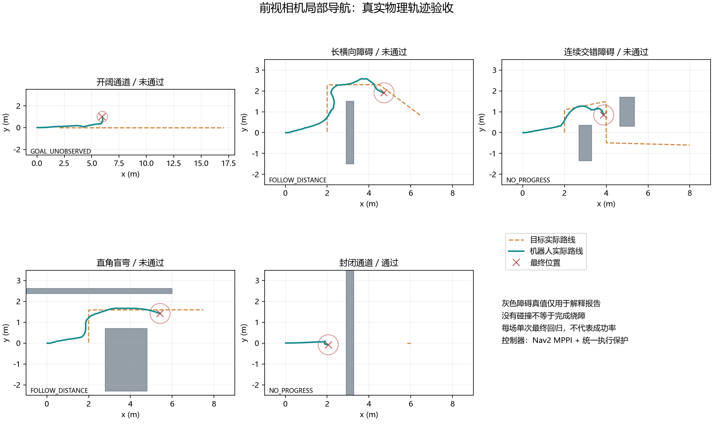
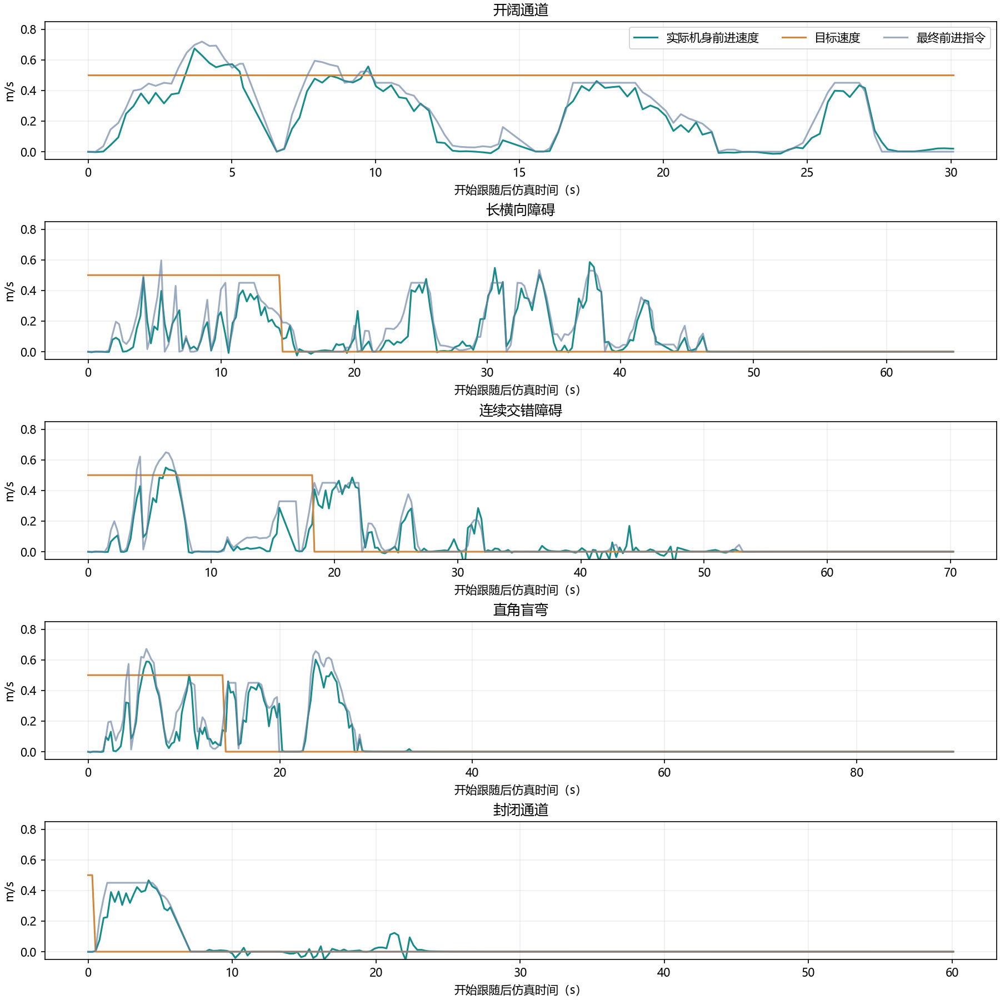

# 观察区域与执行接口验收记录：2026-10-04

本轮先审查执行接口，再将观察任务由单点到达改为实际位置、预测视野和相关新深度共同验证的区域任务。**最终五场中只有封闭停车完整通过；长墙、盲弯完成绕障但不流畅，连续障碍未完成，开阔跟随也失败。开阔稳态实际速度仅 0.188 m/s，相比上一版 0.499 m/s 明显退步，本版没有达到 0.5 m/s 连续平滑跟随。** 63 个逻辑检查通过与 11 组执行基准完成不等于导航通过。

[2026-10-03 历史记录](连续跟随验收记录_20261003.md) 保留修改前成绩，不能作为当前成绩。本轮没有加入最低速度、低速死区补偿或起步响应补偿，也没有编译 ROS。助手启动的 HTTP、仿真、验收及专属 Nav2 进程已全部停止，见下文退出核实；最新源码已复制到现成环境，用户可自行启动验收。

## 1. 执行接口审计：为何恢复航向外环

审计依据为锁定部署 C++ 源码、MuJoCo XML 和实际 ONNX 输入，详见 [执行基准 JSON](execution-region-20261004.json) 的 `interface_audit`。上游提交为 `ca12af336e3a87158b7158b6632509307e2ba669`；模型 SHA256 为 `1b3261d32f1c7b157a98a4f66ac689c89ec10a5032ad9a9a67bd96d4556d6901`。

本次审查没有发现观测布局、关节顺序、历史栈、动作滤波或 PD 参数错接：输入为 `obs=[1,45]`、`hist=[1,10,45]`；关节顺序为 FR、FL、RR、RL，各腿 hip、thigh、calf；陀螺仪缩放 0.25，线速度命令缩放 2，模型角速度命令缩放 0.25，关节速度缩放 0.05；动作按新值 0.8、历史滤波值 0.2 混合，动作幅度 0.25，hip 再减半；站稳后的 PD 为 kp=40、kd=1，策略周期 0.02 s。审查结论不等于正式证明所有执行行为都正确。

实际差异在转向命令生成：模型第三个命令仍是角速度，上游通过航向目标积分和航向误差外环生成该输入。当前 [policy.py](../follow_demo/policy.py) 默认恢复 `heading`：

```text
目标航向 = wrap(目标航向 + 请求角速度 × 0.02)
模型角速度 = clip(0.5 × wrap(目标航向 - 实测航向), -1, 1)
```

`velocity` 模式直接将请求角速度送进模型，现在仅用于成对基准。接口恢复依照锁定策略的部署契约，没有设置最低角速度或抬升低速指令。当前全零指令会将目标航向重置为实测航向，避免停车后继续追旧航向；上游普通零指令保留旧航向，因此这里没有声称复制了完整上游停车行为。基准各模式采用同样阶跃，未使用上游 3 s 线速度淡入。

原始 NP3O 训练配置没有随部署仓库提供。0.7 m/s 超出部署源码所述 0.5 m/s 线速度范围，作为诊断工况保存；它不能证明模型训练范围、实机适用范围或该速度安全。

## 2. 11 组真实执行基准

来源：[汇总 JSON](execution-region-20261004.json)、[逐帧采样](execution-region-20261004-samples.json)；[基准源码核对](execution-region-source-check-20261004.json) 确认其记录的 5 个文件与当前一致。每组独立站稳 4 s、执行恒定指令 16 s、停车 6 s；稳态取第 16～20 s，早期对比取第 8～12 s，采样间隔 0.02 s、物理步长 0.002 s。所有运动由原 ONNX 策略与关节 PD 力矩产生，没有直接移动机身位姿。

| 模式 / 工况 | 请求 vx / wz（m/s、rad/s） | 稳态实际 vx（m/s） | 稳态实际 wz（rad/s） | 停稳时间（s） |
|---|---|---|---|---|
| velocity / 直行 | 0.12 / 0 | 0.0198 | -0.0010 | 0.002 |
| velocity / 直行 | 0.20 / 0 | 0.1364 | -0.0017 | 0.182 |
| velocity / 直行 | 0.30 / 0 | 0.2388 | 0.0101 | 0.142 |
| velocity / 直行 | 0.50 / 0 | 0.4389 | 0.0145 | 0.222 |
| velocity / 超部署说明范围直行 | 0.70 / 0 | 0.6211 | 0.0032 | 0.342 |
| velocity / 慢速转弯 | 0.12 / 0.15 | 0.0163 | 0.0050 | 0.002 |
| heading / 慢速转弯 | 0.12 / 0.15 | 0.0234 | 0.1405 | 0.282 |
| velocity / 行进转弯 | 0.50 / 0.30 | 0.4352 | 0.1844 | 0.342 |
| heading / 行进转弯 | 0.50 / 0.30 | 0.4389 | 0.2940 | 0.362 |
| velocity / 原地转向 | 0 / 0.40 | 0.0006 | 0.0064 | 0.002 |
| heading / 原地转向 | 0 / 0.40 | -0.0075 | 0.3987 | 0.182 |

停稳判据为连续 0.5 s 满足绝对 vx、vy 小于 0.03 m/s，绝对 wz 小于 0.05 rad/s；记录的是这一连续窗口的起点相对停车指令的时间。0.002 s 的结果中，机器人停车前已接近判据阈值，不能理解为实机能在 2 ms 内制动。

11/11 组完成，姿态与最终停车检查通过、退出码 0；这些检查没有要求实际速度等于请求值。数据表明低速线速度仍明显不足：请求 0.12 m/s，实际约 0.020 m/s。恢复 heading 后原地 0.40 rad/s 的稳态响应由直接模式约 0.0064 提升到约 0.3987 rad/s，但执行动态仍有差异：

- heading 原地转向达到持续响应判据约需 2.442 s，早期角速度约 0.2699 rad/s；稳态机体系侧向速度约 -0.0514 m/s。持续转向能力不等于固定位置旋转，也不能据此确认 0.10 m 漂移余量足够。
- heading 慢速转弯建立持续转向约需 7.582 s，稳态角速度约 0.1405 rad/s，但前进速度只有 0.0234 m/s；没有消除用户暂不处理的低速响应问题。
- heading 行进转弯建立持续转向约需 2.902 s，稳态角速度约 0.2940 rad/s；MPPI 的理想差速预测尚不能直接当作这套步态的完整动态模型。

持续响应判据为半秒内保持绝对速度达到请求值的 20%，且线/角速度至少 0.02 m/s 或 0.02 rad/s；上述时间不是精确跟踪收敛时间。基准是有限时长的开环物理对照，不是 Go2 实机接口认证。

## 3. 观察区域：用实际位置和新深度替代单点距离判定

[local_planner.py](../follow_demo/local_planner.py) 仍在相机证据形成的已知连通区内搜索。完整安全包络和未知不可通行规则不变；额外 0.10 m 仅筛选观察姿态的暂定漂移空间，不膨胀整条路径。观察候选预算仍为 32：近身点最多 8、粗空间代表最多 16、其余席位用于邻格细化。

选定参考位置与朝向后，保存该视向预测可揭示的未知世界格。区域在参考位置 0.35 m 邻域中逐格构造，每格须满足漂移余量、未知视野收益至少 10%、对原相关前沿的可见覆盖至少 30%，并保留中心所在连通分量，禁止斜穿墙角。**0.35 m 是区域生成范围，不是直接放大的到达容差。**

[observation.py](../follow_demo/observation.py) 的阶段语义为：

| 阶段 | 当前判断与执行 |
|---|---|
| `MOVE` | `FollowPath` 接近参考路径；实际位置必须进入区域，并以连续坐标重查净空、视野收益、相关前沿覆盖及实测停车空间，才准入看向 |
| `ORIENT` | 锚定实际准入位置，`Observe` 完成指定朝向，前进候选约束为零；实际漂移离开有效区域时回到移动，旧阶段候选失效 |
| `EVALUATE` | 停车并复查朝向，等待朝向到位后至少两帧新深度及 0.4 s，再检查相关前沿真实新证据 |

原 0.08 m 位置容差仍用于参考点接近与“接近终点却已没有有效观察区域”的失败判断，不能单独宣告观察完成。进入区域后，若新观测的墙合理遮住原预测前沿，相关障碍测量可以解释覆盖变化；不能凭空假定墙后可见。

观察完成要求相关前沿中至少 `max(3, ceil(开始时尚未知相关格数 × 5%))` 个格子成为新已知，且其深度采集时间不早于朝向到位时刻。窗口滚动、其他方向的新格和只有相机帧计数增加都不能充当完成证据。新已知可能是障碍；诊断另记录新增自由格与包络可通行格，**获得信息不等于获得可通行通道**。等待 2 s 仍缺相关新证据则记录 `OBSERVATION_NO_RELEVANT_GAIN` 并换视点。

观察任务结束后，尝试历史保存 `[实际 x, 实际 y, 观察朝向, 原完整观察区域]`，而非仅保存实际停点。区域准入允许停在参考点之前，停点与参考点可能相距超过旧 0.20 m 半径；若仍按停点去重，原参考点会再次被选中，同一区域的无收益任务反复启动。

共享 `observation_attempted` 按当前地图分辨率，把候选与原区域位置映射到世界格：只有属于原区域且视向差小于 0.35 rad 才排除。记录的区域不扩大，区域外的位置和未尝试的新视向仍可选择；旧三项记录保留原 0.20 m 半径判断。搜索阶段和 Future 接入阶段使用同一函数，后者读取当前尝试历史，避免旧搜索重新装载已经尝试过的区域。最近 24 条任务记录保留，区域以独立副本保存。

单次观察 15 s、转向 4 s 无角度进展、连续观察 40 s 总预算及 `NO_PROGRESS` 锁定继续保留。参数仍属仿真工程配置，实机漂移、相机退化和 RK3588 算力没有获得本轮认证。

## 4. 密集视野与失效计划处理

新增 [observation_geometry.py](../follow_demo/observation_geometry.py) 统一候选收益、区域构造和实际位置准入的几何判断。预测扇区为 ±0.68 rad、最远 3.1 m，按地图半格间距采样；0～0.7 m 覆盖负责发现近处遮挡，收益在 0.7～3.1 m 统计，已知障碍表面可见、其后射线被遮挡。

**这个机身平面扇区仍是视野预测占位，不能等同于左相机光心能够真实测到的区域。** 它尚未用左光心 `CameraInfo`、采集时刻 TF、可测地面/障碍高度带及图像 ROI 完整约束预测与相关前沿。新深度完成判断比仅计帧数严格，但现有证据不足以证明所有预测前沿都受实际传感器支持，也不足以把五场失败归为这一项唯一原因。

0.10 m 地图下每视野为 86 条射线、每线 63 个径向样本。评分按 16 视野分批，以格 mask 去重，区域覆盖直接做 mask 交集，仅在对外返回已选视野时构造世界格集合；缓存分辨率对应的射线模板。连续位置、朝向与当前地图仍重新计算，没有复用旧地图结果。这是实现层的批量化优化；最终场景的规划耗时见下表，不能据 x86 仿真结果承诺 RK3588 性能。

[navigation.py](../follow_demo/navigation.py) 接入搜索结果前，先用最新地图与实测位置检查当前位置到候选路线的连接和整条剩余路径，验证通过后才替换任务。无效候选只增加 `RETURNED_PATH_INVALID` 拒收诊断，不先创建观察任务，也不以无效跟随路线抢占有效观察，避免“先接入、下一拍发现冲突、再清空”的循环。

`invalidate_plan` 同时清观察上下文、旧路径和旧候选，更新计划版本与失效时间边界。尚未开始的搜索任务可以取消；已在运行的旧 Future 返回后，请求时间早于失效边界的结果不会重新装载。观察结束、输入失效、路径冲突或观察上下文丢失均须重新获取一致计划。操作状态通信中断经 `halt(INPUT_LOST, OPERATOR_STALE, now=当前时刻)` 统一撤销，更新同一搜索时间屏障，避免恢复后重放中断前结果。

观察诊断保留跨下一次 `begin` 的 `last_outcome`，包含上一任务序号、终止原因、实测位置/朝向与相关新证据数量。低频验收采样可以看到上一任务为何结束，而不会因新任务清空当前结果就遗漏终止原因。

## 5. 逻辑检查与前三轮诊断

最终冻结版 63 个 Python 逻辑检查在 0.423 s 内通过，见 [单元检查日志](../logs/observation-region-unit-20261004.log)。新增 6 个区域尝试反例覆盖区域内/外、不同朝向、旧三项兼容、实际停点与参考点分离、当前分辨率及 Future 拒收。检查没有编译 ROS，不能代替五场物理验收。

[首轮连续交错报告](region-first-integration-20261004/navigation-region-20261004-consecutive.json) 与采样归档在 `region-first-integration-20261004/`。70 s、目标速度 0.50 m/s 的这一诊断轮：基础安全与刺激有效检查通过，但任务完成和流畅性失败；最终位置约 `[3.996, 0.769] m`、间距 4.222 m、原因 `FOOTPRINT_UNKNOWN`，峰值规划耗时约 2098.7 ms。

该报告与当前源码的 `local_planner.py`、`navigation.py`、`observation.py`、`observation_geometry.py`、`navigation_config.py` 和场景检查脚本等文件哈希不同。它提供性能与状态失效诊断线索，不能作为后续优化版本的最终失败或通过证据，也不能因零碰撞改写成绕障完成。

[第二轮连续交错报告](region-second-integration-20261004/navigation-region-20261004-consecutive.json) 归档在 `region-second-integration-20261004/`。同样 70 s、目标 0.50 m/s，基础安全和刺激有效检查通过，任务与流畅性失败；最终位置约 `[3.973, 1.893] m`、间距 4.728 m、原因 `NO_PROGRESS`，峰值规划耗时 339.7 ms。其诊断是多次接入路线后立即 `PATH_INVALID`，因此随后增加了接入前整路验证；不能归因为已完成的看向动作被异步抢占。第二轮早于最终冻结版的计划接入、操作通信失效和终止诊断修复，不计入本轮最终五场结果。

[第三轮五场退出码](region-third-integration-20261004/navigation-region-20261004-suite-exit-codes.json) 及全部报告、采样归档在 `region-third-integration-20261004/`。这一轮发生在完整观察区域去重修复之前，保留为诊断历史。`navigation-region-20261004-*` 是旧诊断前缀，不能当作最终冻结版成绩。

## 6. 最终五场物理验收：未达到连续跟随目标

最终五场使用独立前缀 **`navigation-region-final-20261004`**，目标速度均为 0.50 m/s。原始报告为 [开阔](navigation-region-final-20261004-open.json)、[长墙](navigation-region-final-20261004-long_wall.json)、[连续障碍](navigation-region-final-20261004-consecutive.json)、[盲弯](navigation-region-final-20261004-corner.json)、[封闭](navigation-region-final-20261004-blocked.json)，各有同名 `-samples.json`；[运行日志](../logs/observation-region-final-suite-20261004.log) 与 [退出码](navigation-region-final-20261004-suite-exit-codes.json) 一并保留。以下显示值经过四舍五入，完整精度以 JSON 为准。

| 场景 / 时长 | 基础安全 / 刺激有效 | 任务判定的含义 | 流畅性 | 整体 / 退出码 |
|---|---|---|---|---|
| 开阔 / 30 s | 通过 / 通过 | 位移进展检查通过；不能据此称跟随完成 | 失败 | 失败 / 1 |
| 长墙 / 65 s | 通过 / 通过 | 整机绕到远侧，目标到终点，最终间距恢复 | 失败 | 失败 / 1 |
| 连续障碍 / 70 s | 通过 / 通过 | 未到第二障碍远侧，最终间距超限 | 失败 | 失败 / 1 |
| 盲弯 / 90 s | 通过 / 通过 | 完成转弯绕行，目标到终点，最终间距恢复 | 失败 | 失败 / 1 |
| 封闭 / 60 s | 通过 / 通过 | 在墙前稳定停车 | 不适用 | 通过 / 0 |

五场基础安全都通过，含无物理障碍接触、姿态、阶段限速、深度/UWB 失效命令归零及 MPPI 存活检查；这没有证明真实机器狗的制动或动态障碍安全。封闭报告的 `fluency.passed=true` 是“不适用”的占位结果，不能写成流畅跟随通过。开阔 `scenario_objective_met=true` 只覆盖位移进展与最终采样窗口，并未包含跟随间距或 0.5 m/s 速度要求。

| 场景 | 目标移动期间实际 vx 均值（m/s） | 低于 0.05 m/s 占比 | 最长连续低速（s） | 移动期间最大间距（m） | WAITING 累计（s） |
|---|---|---|---|---|---|
| 开阔 | 0.234642 | 30.71% | 3.24 | 10.9912 | 0.50 |
| 长墙 | 0.172948 | 21.31% | 1.04 | 4.3862 | 3.23 |
| 连续障碍 | 0.141590 | 51.91% | 3.43 | 6.1017 | 22.08 |
| 盲弯 | 0.209387 | 18.81% | 1.04 | 5.5822 | 2.99 |
| 封闭 | 不适用 | 不适用 | 不适用 | 不适用 | 38.72 |

`WAITING` 是状态累计时间，低速占比还包含其他阶段的实际运动，二者不能互相替代。实际 vx 是机体系前进速度，并非轨迹速度模长。流畅门槛为：开阔稳态至少 0.45 m/s；绕障期间实际 vx 均值至少 0.35 m/s；目标移动期间最大间距小于 3.5 m、低速占比不超过 15%、单段连续低速不超过 2 s。长墙与盲弯的单段低速时长通过，但速度、间距和低速比例均失败；连续障碍四项均失败。

**开阔稳态实际 vx 为 0.188309 m/s，目标移动期间均值为 0.234642 m/s，最终间距 11.1533 m。相比 2026-10-03 的 0.499 m/s，这一版明显退步。** 不因恢复航向外环或观察区域实现完成，就宣称效果已经改善。

| 场景 | 最终机器人位置 x / y（m） | 最终间距（m） | 最终原因 | 峰值规划耗时（ms） |
|---|---|---|---|---|
| 开阔 | 5.975155 / 1.006366 | 11.153340 | `GOAL_UNOBSERVED` | 354.45 |
| 长墙 | 4.724303 / 1.907681 | 2.083692 | `FOLLOW_DISTANCE` | 378.58 |
| 连续障碍 | 3.876767 / 0.843593 | 4.359562 | `NO_PROGRESS` | 356.72 |
| 盲弯 | 5.421956 / 1.423407 | 2.076558 | `FOLLOW_DISTANCE` | 336.61 |
| 封闭 | 2.052470 / -0.077217 | 3.938287 | `NO_PROGRESS` | 330.59 |

连续障碍要求机器人中心至少到达 x=5.90 m，当前仅到 x=3.876767 m；即使没有碰撞，也没有完成绕障。封闭的 `NO_PROGRESS` 符合此场景无法通行后稳定停车的目标。峰值耗时是本次桌面仿真的单轮搜索测量，不等于 RK3588 可达性能。

以下轨迹用完整物理场景辅助人工复核；真实障碍几何没有提供给规划器。速度图同时显示目标与实际前进速度，不能只看命令大小判断跟随效果。



[下载矢量轨迹图](navigation-region-final-20261004-trajectories.svg)



[源码核对](observation-region-final-source-check-20261004.json) 确认五场各记录的 17 个文件都与当前源码一致，五场没有混入不同算法版本。这里只有每场一次运行，不能据此给出重复运行成功率。前三轮诊断与本轮最终成绩继续分开保存。

## 7. 下一步优先级与证据边界

本轮结果表明当前组合尚不满足产品目标；它没有单独证伪历史地图、局部搜索或 MPPI 整条架构，也没有证明某一个模块是唯一原因。接下来应先把执行和传感器假设落实，再评价更复杂的探索策略：

1. **建立转向响应动态与可达轨迹管。** heading 原地/行进转向持续响应分别约需 2.442 / 2.902 s，并伴随侧向漂移；[第三轮连续障碍采样](region-third-integration-20261004/navigation-region-20261004-consecutive-samples.json) 还保留零命令后跨格边界的漂移诊断。应按实测状态预测未来一段时间可能扫过的机身区域、转向延迟与停车过程，再统一规划、观察准入和执行校验；固定 0.10 m 余量及理想差速预测不足以代表完整动态。这一步不需要先加入用户暂缓的低速或起步补偿。
2. **限定真实相机可支持的观察区域。** 用左光心 `CameraInfo`、采集时刻 TF 和平地的可测高度带/图像 ROI 生成相关前沿，再以每帧实际采集位姿核对新证据。机身平面扇区只提供预测；须区分“预计会看见”与“当前相机确实能测到”。现有相关增益不足时，记录缺失证据，不能自动断言唯一根因。
3. **以新增长的可通行通道决定探索进展，并拼接剩余路线。** 信息收益可以用于候选筛选，但新障碍或未知面积减少不等于安全通道延伸。执行与传感器一致后，应优先评价新增 `allowed` 连通通道是否接近跟随区域，保留仍安全的已走路线并拼接新增段，减少每个短终点反复停转。新增策略仍须以同样的五场任务与流畅门槛验收。

## 8. 关闭核实与自行复现

[退出核实](observation-region-final-cleanup-20261004.json) 在 2026-10-04 04:03:03 UTC 记录 `all_stopped=true`：HTTP 已关闭，实验台/验收进程列表和专属 Nav2 进程列表为空，MPPI 进程清单已移除，最后的 Windows WSL 包装进程 PID 5628 也已退出。仅清理本任务启动的进程，没有关闭整台 WSL 或 Docker。保留断开的浏览器页面不代表服务仍在运行。

最新源码已安装到 `~/go2_sim/follow_demo`。在 Windows PowerShell 自行启动：

```powershell
& 'C:\Users\chy\Documents\ChatGPT\go2_slam 2\sim_env\Start-FollowDemo.ps1'
```

打开 [实验台](http://127.0.0.1:8765/)，先选择场景并重置，等姿态就绪；保持暂停并确认起始周围 1.2 m 净空；保持目标速度 0.50 m/s，点击“开始 / 恢复跟随”，再让目标沿场景路线行走。完整步骤和观察项见 [实验台说明](../follow_demo/README.md)。该启动入口用于查看当前失败版本，不构成用户验收通过。

结束人工验收后执行停止脚本；仅关闭网页不会停仿真：

```powershell
& 'C:\Users\chy\Documents\ChatGPT\go2_slam 2\sim_env\Stop-FollowDemo.ps1'
```

如需复跑五场，先停止人工实例；脚本为每场启动专属实例，检查后停止并核实退出。同前缀旧结果会归档，失败仍保留非零退出码：

```powershell
& 'C:\Users\chy\Documents\ChatGPT\go2_slam 2\sim_env\Check-NavigationDemo.ps1' -Scenarios open,long_wall,consecutive,corner,blocked -Speed 0.5 -ReportPrefix navigation-region-final-20261004
```
