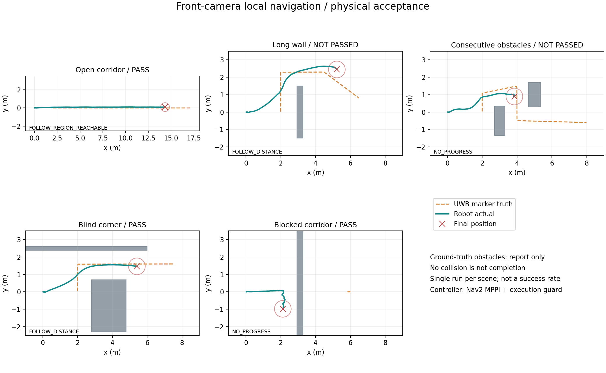
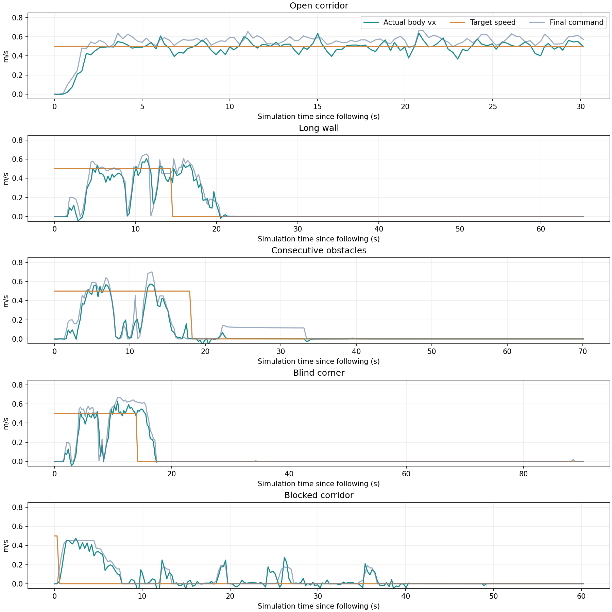

# 连续跟随验收记录：2026-10-03

本轮采用真实 Nav2 MPPI、MuJoCo 物理步进和原 ONNX 步态策略，目标沿预置路线以 **0.50 m/s** 行走。**开阔跟随、直角盲弯和封闭停车通过本轮规则；长墙完成绕行但流畅性未通过，连续障碍未完成。整体尚未达到流畅平滑跟随避障的目标。** 每个场景最终保留一轮完整测试，不能据此估计成功率。

网页已在测试期间显示，之后按要求关闭本轮启动的网页服务、仿真、检查程序和专属 Nav2 进程。网页标签保留供自行启动后查看；服务关闭后画面不再更新。没有关闭其他任务或整台 WSL。[关闭核实记录](navigation-v2-shutdown-check.json) 保存了 HTTP 不可达和任务进程不存在的检查结果。

## 1. 本轮实际效果

| 场景 | 基础安全 / 刺激有效 | 任务完成 | 流畅性 | 实际速度 | 移动期间低速占比 | 移动期间最大间距 | 最终间距 / 原因 |
|---|---|---|---|---|---|---|---|
| 开阔通道 | 通过 / 通过 | 通过 | 通过 | 稳态 0.499 m/s | 0% | 2.812 m | 2.770 m，持续跟随 |
| 长横向障碍 | 通过 / 通过 | 通过 | 未通过 | 移动均速 0.345 m/s | 12.76% | 3.522 m | 2.075 m，`FOLLOW_DISTANCE` |
| 连续交错障碍 | 通过 / 通过 | 未通过 | 未通过 | 移动均速 0.260 m/s | 22.99% | 4.339 m | 4.402 m，`NO_PROGRESS` |
| 直角盲弯 | 通过 / 通过 | 通过 | 通过 | 移动均速 0.371 m/s | 10.83% | 3.471 m | 2.085 m，`FOLLOW_DISTANCE` |
| 封闭通道 | 通过 / 通过 | 稳定停车通过 | 停车检查通过 | 移动跟随指标不适用 | 不适用 | 不适用 | 3.991 m，`NO_PROGRESS` |

长墙的两项未通过门槛是移动均速低于 0.35 m/s、移动期间最大间距不小于 3.5 m；最长连续低速 1.06 s 在允许范围内。连续障碍没有完整跨过第二个障碍，最长连续低速 1.08 s 虽然不超限，累计低速时间和掉队仍不合格。不能用“单次停车不长”代替连续跟随效果。

封闭场景先沿墙探查后停止，末窗 1.88 s 全为零命令，包络距墙约 0.249 m，实际最大绝对前进速度为 0.000595 m/s、角速度为 0.001191 rad/s，已近乎停稳。盲弯末窗偶有 0.02 m/s 指令，实际速度低于 0.001882 m/s；不要描述为每个末窗样本都严格零命令。



青色是机器狗实际轨迹，橙色虚线是虚拟目标实际轨迹，灰色是障碍真值，仅用于验收图。图中的完整场景真值不输入规划器。长墙和连续障碍标题保留未通过标记。



速度图包含起步、目标停止及保持阶段。表内速度为机身坐标系实测前进速度，不能理解为绕行路径的平均世界位移速度。

## 2. 本轮修复及原因

- 观察任务按“移动到视点 → 看向 → 等新深度”执行。原先 0.20 m 到达判据会在错误视点提前转头；现在与 MPPI 统一为 0.08 m，阶段切换撤销旧动作并清除旧移动候选。看向阶段前进候选为零，评估期间重新核对实际朝向，防止残余转动导致错误宣告观察完成。
- 普通路径的方向软代价保留至距终点 0.08 m。原先在 0.30 m 内关闭方向代价，会让短观察路径过早失去转向引导；固定位置看向仍使用单独控制器。它不引入“目标偏角大就抢占绕障”的硬停车规则。[Nav2 1.1.20 对应实现](https://raw.githubusercontent.com/ros-navigation/navigation2/1.1.20/nav2_mppi_controller/src/critics/path_angle_critic.cpp) 可用于核对参数语义。
- 观察点要求额外 0.10 m 暂定漂移空间，但路径本身保持原安全包络。候选总预算 32 个，保留 16 个粗空间代表，再加入近身和细化位置；全用密集近邻格会挤掉远处视点。这个漂移余量还没有实机标定。
- 静态历史地图保留曾确认的自由通道，同时维持深度健康检查。未知区域不自动变成可通行区域。局部搜索在单独线程执行，传感器和导航使用不同 ROS 执行器，减少搜索阻塞数据接收。
- 保持跟随距离时检查狗到目标的自由视线及当前完整包络。此前把目标视线也当成整机通行路径膨胀，会被目标附近未知格反复否决，触发无意义重规划。长墙本轮已能正确保持正常间距。
- 连续观察最多 40 s；无有效进展则锁存 `NO_PROGRESS`。新地图格数的偶然增加不能反复解除停止。手动暂停再恢复或重置场景才开始新一轮尝试。
- 修正 MPPI 所需里程计 QoS、过时动作与重置后的命令隔离；最终命令仍经过统一限速、平滑和实测停车轨迹检查。暂停、深度/UWB 中断和失效动作输出零命令。

这些修复解决了规划和状态切换的实际问题，但没有证明整个跟随任务已经完成。

## 3. 仍未解决的根因与下一步

连续障碍在短观察路径末端停滞：原始前进候选约 0.11～0.12 m/s，实际位移很小，仍距所选视点约 0.10 m，未达到 0.08 m 完成条件，最终触发 `NO_PROGRESS`。不能因为差一点到达就放大容差宣告成功；候选视点的信息收益依赖实际到达位置。

[独立执行基准](execution-v2.json) 绕过导航直接测试相同模型：输入 0.50 m/s 直行，实际均速约 0.439 m/s；输入角速度 0.40 rad/s 原地转动，实际约 0.0078 rad/s；输入前进 0.50 m/s 加角速度 0.30 rad/s，实际角速度约 0.186 rad/s。说明差速运动预测与当前步态策略的实际响应存在明显差异。导航里的速度修正可以让开阔稳态达到 0.499 m/s，但不能据此认为所有短路径和原地观察也能执行准确。

**下一步应优先把实测运动响应接入候选预测，并把单点观察改为满足安全和信息收益的可达区域，减少对小位移精确收敛的依赖。** 同时保持局部参考路径连续，单独验证连续障碍是否完整通过、速度是否稳定。先明确当前步态策略命令语义与模型适用性，再决定是否需要调整执行模型。按照用户要求，本轮没有增加最低速度、低速死区补偿或起步响应补偿，也没有提高验收容差掩盖失败。现有证据不足以认定整套 UWB → 局部搜索 → MPPI 架构不可行。

## 4. 自行启动和查看网页

双击 [Start-FollowDemo.cmd](../Start-FollowDemo.cmd)，或在 Windows PowerShell 执行：

```powershell
& 'C:\Users\chy\Documents\ChatGPT\go2_slam 2\sim_env\Start-FollowDemo.ps1'
```

打开 [http://127.0.0.1:8765/](http://127.0.0.1:8765/)。每个场景按下面顺序操作：

1. 选择场景并“载入场景并重置”，等待姿态就绪。
2. 在暂停状态确认起始周围半径 1.2 m 净空。
3. 目标速度保持 0.50 m/s，点击“开始 / 恢复跟随”，再点“目标沿场景路线行走”。
4. 查看物理运动、前视相机、有限观测地图和速度栏。黄色线是规划路径，紫色线是停车预测；对照指令速度与实际速度。
5. 优先复验长墙和连续障碍。目标走完不等于机器人绕障完成；注意有没有完整跨过障碍、掉队和反复停车。需要时下载 CSV。

结束后双击 [Stop-FollowDemo.cmd](../Stop-FollowDemo.cmd)，或执行：

```powershell
& 'C:\Users\chy\Documents\ChatGPT\go2_slam 2\sim_env\Stop-FollowDemo.ps1'
```

只关闭浏览器不会停止后台仿真。等待脚本确认 HTTP、仿真及专属 Nav2 子进程均已退出。

## 5. 自动复现与证据索引

自动验收拒绝复用正在运行的人工实例。先结束人工演示，再执行：

```powershell
& 'C:\Users\chy\Documents\ChatGPT\go2_slam 2\sim_env\Check-NavigationDemo.ps1' -Speed 0.5
# 只重跑两个失败场景：
& 'C:\Users\chy\Documents\ChatGPT\go2_slam 2\sim_env\Check-NavigationDemo.ps1' -Scenarios long_wall,consecutive -Speed 0.5
```

脚本顺序启动、测试并关闭每个实例。开阔 / 长墙 / 连续障碍 / 盲弯 / 封闭场景的采样时长分别为 30 / 65 / 70 / 90 / 60 s。当前两个场景未通过，因此整套脚本退出码为 1，这是失败结果被保留，不是所有检查都通过。

本轮运行在 WSL Ubuntu 22.04、ROS 2 Humble 的已安装环境，使用发行版 Nav2 1.1.20 运行包。安装脚本复制 Python 源码并检查依赖，没有编译 ROS。39 个 Python 单元检查通过，见 [单元检查日志](../logs/navigation-v2-unit-check-20261003.log)。

- 最终报告：[开阔](navigation-v2-open.json)、[长墙](navigation-v2-long_wall.json)、[连续障碍](navigation-v2-consecutive.json)、[盲弯](navigation-v2-corner.json)、[封闭](navigation-v2-blocked.json)。每份有同名 `-samples.json` 原始采样。
- [最终套件日志](../logs/navigation-v2-suite-final-20261003.log)、[各场景退出码](navigation-v2-suite-exit-codes.json)、[关闭核实](navigation-v2-shutdown-check.json)。
- [步态执行基准](execution-v2.json) 和 [执行采样](execution-v2-samples.json)，只证明仿真执行响应。
- 五场最终报告采用规则版本 3，每份记录 15 个源码 SHA256；已核对五份一致且匹配本轮源码。基础安全、刺激有效、任务完成和流畅性分别判断，累计物理障碍接触为零。
- `v2-before-final-fixes-20261003/` 保留前一轮报告，`v2-run-history-20261003/` 保留中间运行历史。此前可见的独立长墙演示保存在 `visible-demo-long_wall.json` 及对应采样，流畅性同样未通过；它与最终代码版本不同，不并入最终五场证据。

流畅性采用按时间加权的指标：人的移动速度大于 0.15 m/s 时评估，移动窗口排除最初 2 s，开阔稳态排除最初 8 s；完整速度图仍保留全部时间。开阔稳态至少观测 5 s、实际速度至少 0.45 m/s。绕障均速至少 0.35 m/s、实际速度低于 0.05 m/s 的时间占比不超过 15%、最长连续低速不超过 2 s、移动期间最大间距小于 3.5 m。封闭场景专门评估稳定停车。

## 6. 适用范围

本轮只覆盖平地和静态障碍。D435i 仍是理想深度渲染，定位使用仿真真值；未接入实测 CAPO/VIO，未验证 RK3588 计算负载。历史自由空间不能保证侧后方没有新闯入的人或物。虚拟 UWB 标记不模拟真实人体遮挡、NLOS、多径或动态人体碰撞。相机安装外参、观测漂移余量与制动参数仍需实机测量。

零碰撞只属于本轮仿真证据；它不能代替实机验收，也不能代替绕障完成和流畅性验收。
