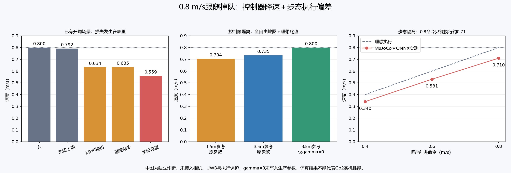

# 速度慢、跟不上：链路排查（2026-10-06）

**开阔直行的主要损失在MPPI速度选择和步态执行；绕障另外叠加观察停顿、规划等待及末级制动约束。不能只靠缩小安全距离解决。** 本轮新增诊断入口和证据文件；26个原验收使用的生产源码摘要全部一致。人的0.8 m/s、前进命令上限0.8 m/s、角速度上限1.0 rad/s及0.70×0.32 m矩形均保持原设置。

## 1. 开阔直行：速度损失发生在哪里

复算此前完整物理闭环批次 `navigation-full-08-20261005-232723` 的开阔场景。按原验收窗口排除开始后的前八秒，按仿真时间加权，实际稳态窗口11.09秒：

| 环节 | 平均值 | 说明 |
|---|---:|---|
| 人的实际速度 | 0.800 m/s | 测试刺激正确 |
| 导航估计的人速 | 0.799 m/s | 没有把人的速度估低 |
| 阶段前进上限 | 0.792 m/s | 基本已经允许0.8 |
| MPPI原始候选 | 0.634 m/s | 主要命令损失已经发生 |
| 最终底盘命令 | 0.635 m/s | 平滑器有历史，不要求每拍等于MPPI原始输出 |
| MuJoCo中实际机体系vx | 0.559 m/s | 步态执行还损失约12% |

该窗口 `EXECUTION_LIMITED` 占比为0，平均控制器命令年龄约0.0095秒，未记录物理障碍接触。因此，开阔直行掉队的主要原因并非最后一级安全校验压低了速度。这个判断只适用于该窗口，不能延伸为绕障阶段的安全校验没有影响。



## 2. MPPI隔离：短路径有影响，控制正则项影响更明显

新建独立诊断：真实Nav2 C++ MPPI、全自由地图、理想积分底盘，每0.4秒更新直线参考；仍将命令限制在0.8/1.0。这里有意去掉相机、UWB、步态和本项目末级执行保护，以区分控制器自身的速度选择。全自由地图没有写入生产导航。

每场首次动作接受后运行16秒，统计第6～15秒；有效场次动作失效占比均为0：

| 对照 | 平均候选vx | 解释 |
|---|---:|---|
| 1.5 m参考，原参数 | 0.704 m/s | 短参考下速度更低 |
| 3.5 m参考，原参数 | 0.735 m/s | 延长参考有帮助，但仍达不到上限 |
| 3.5 m参考，仅 `gamma=0` | 0.800 m/s | 控制正则项确实参与压低速度 |
| 3.5 m参考，`vx_std=0.10`，gamma保持原值 | 0.160 m/s | 单独缩小采样噪声明显恶化 |
| 3.5 m参考，模型步长1/30、72步 | 0.583 m/s | 保持2.4秒时域，对齐步长也未提升速度 |

另外独立重复：原长参考0.7349、长参考 `gamma=0` 为0.8000；短参考 `gamma=0` 为0.7904 m/s。重复支持正则项降速这个方向，不能把这些独立实验的差值直接相加，预测真实导航改善量。

当前MPPI接收的是几何路径、地图和实测里程计，没有接收“人的期望跟随速度”或时标轨迹。`vx_max=0.8`只是约束，不会要求优化器持续选择0.8。

核对本机Nav2 1.1.20版本的[优化器源码](https://raw.githubusercontent.com/ros-navigation/navigation2/1.1.20/nav2_mppi_controller/src/optimizer.cpp)：控制扰动项包含 `gamma / vx_std²`。当前为0.015/0.25²=0.24；只把噪声改成0.10会变成1.5，系数增大6.25倍。它是带控制序列与扰动乘积的更新项，不能简单等同于固定线速度惩罚。实测也说明这些参数需要与跟随进度目标一起设计，不能逐个凭感觉调。

本轮 `gamma=0` 只是识别根因的对照。它没有经过障碍、转弯、平滑性或实机验证，**没有写回默认参数**。对齐步长实验还同时改变了预测步数与序列移位行为，不能从这个结果断言步长本身是降速原因。

## 3. 为什么参考路径会短

原开阔报告中，人已经在狗前方5～7米时，保存的整段规划路径常约1.5～2.2米；实际送给MPPI的剩余路线还会裁去经过的部分。这与2.4秒预测时域下0.8 m/s需要约1.92米的前进长度不总匹配。

当前跟随区域评分包含参考长度不足惩罚，但距离区域不可达时进入的 `KNOWN_CORRIDOR_PROGRESS` 分支没有同样的长度需求。它同时考虑接近目标、加权路程、净空和前一终点，可能选出比安全可达距离更短的参考。

最初怀疑进展分支的加权预算3.8过小。保存末帧地图的离线重算纠正了这个判断：

| 加权预算 | 候选最远直线距离 | 最终选出的参考长度 | 完整矩形路线校验 |
|---|---:|---:|---|
| 3.8（生产值） | 2.594 m | 1.772 m | 通过 |
| 6.0（仅离线） | 3.594 m | 1.772 m | 通过 |
| 10.0（仅离线） | 3.675 m | 1.772 m | 通过 |

选中点的加权代价仅2.252，小于3.8。在这张图上，单独放大预算不能解决短参考；终点评分没有把持续跟随所需参考长度明确纳入进展分支，才是下一步应处理的设计问题。该实验只重算末帧附近的地图，不是对早期全部路径的反事实证明；地图边界与净空偏好也会影响选点。

Nav2的[PathFollowCritic](https://raw.githubusercontent.com/ros-navigation/navigation2/1.1.20/nav2_mppi_controller/src/critics/path_follow_critic.cpp)以预测轨迹末端到选定路径点的距离计代价，选点受路径终点截断；[GoalCritic](https://raw.githubusercontent.com/ros-navigation/navigation2/1.1.20/nav2_mppi_controller/src/critics/goal_critic.cpp)在靠近路径终点时启用。因此有限几何参考会影响速度选择，但不能直接把滚动路径末端当成人的停止位置。

## 4. 步态隔离：0.8命令不等于0.8实际速度

使用当前锁定ONNX模型与MuJoCo动力学。站稳4秒，恒定命令16秒，再停车6秒；统计恒定运动最后4秒。不接入导航、相机或ROS命令，不添加死区与起步补偿。

| 恒定输入 | 实际平均vx | 实际/命令 |
|---|---:|---:|
| rate直行0.4 | 0.340 m/s | 85.1% |
| rate直行0.6 | 0.531 m/s | 88.4% |
| rate直行0.8 | 0.710 m/s | 88.7% |
| velocity直行0.8 | 0.710 m/s | 88.7% |
| rate 0.8＋左转0.3 rad/s | 0.698 m/s | 87.2% |
| rate 0.8＋右转−0.3 rad/s | 0.696 m/s | 87.0% |

两种直行接口几乎一致，排除了当前角速度反馈接口造成这部分线速度偏差的解释。原模型输入只是速度指令，并没有外部线速度闭环保证实测vx等于指令。

六场均完成姿态与停车检查，这只证明这些基准正常运行，不证明跟随速度达标。结论是**当前仿真步态的执行能力**，不能代替Go2官方运动接口的实机测试，也不能直接将实机判为只能跑0.71 m/s。

在当前策略输入上限仍为0.8的条件下，即使修正MPPI让它一直输出上限，这个模型也不能持续追上0.8 m/s的人。把上游速度命令写成0.8不等于已经获得0.8的物理能力。

## 5. 连续交错复测：另有长停车机制

本轮原参数重新运行两圈交错场景：`speed-chain-slalom-20261006-slalom_loop`。26个生产摘要与此前批次一致，刺激有效、基本安全检查通过，流畅性和任务完成仍未通过。人完成2圈，狗完成0圈；移动平均实际vx为0.165 m/s，低速占比54.9%，最长低速12.94秒，移动窗口最大间距10.58米。

移动期间累计低速时间中，约12.49秒标记 `EXECUTION_LIMITED`、10.50秒处于 `GOAL_UNOBSERVED`、5.30秒等待规划、4.55秒出现机身包络占据告警、3.58秒因制动空间停车；另外已有有效路线时也有低速跟踪。低速按abs(vx)<0.05定义，部分时间仍在转向。

一个具体样本：MPPI候选约0.598 m/s，平滑后的请求0.0944，末级制动检查再削到0.0472，实际vx约0.0302。另一处出现 `FOOTPRINT_OCCUPIED` 时，候选0.726但最终命令归零。不能把全部差值算作安全校验单独造成：平滑器的反复起停和前序状态已经先降低了请求。

这说明：几何搜索与MPPI选择的运动，经常到最后一级才被发现不能通过保持/制动包络。最终校验使用深度年龄、残余前速、转速和侧移；规划的几何可通行与可连续执行并不等价。当前主要靠末级缩放、归零，再重新起步，容易形成低速循环。应把同一约束提前用于路径速度规划与控制优化。

观察模式仍为 `cone`。本次观察位置附近出现过预测收益较高但实际相关自由证据一直没有增加的样本。下一步需要核对真实CameraInfo/TF投影、朝向响应和ROI收益；不能直接把未知格改为自由，也不能承诺简单切换已有 `camera` 分支就会通过。

本次保留了独立Nav2原生日志，**未复现上轮动作中止和39秒NO_PROGRESS锁定**；样本保留的动作结束结果均为成功状态4，日志没有优化失败或进展失败错误。因此，上轮状态6的确切内部原因仍未确定，不能用这次日志反推上轮。两轮都严重低速、均未完成任务，说明问题并不只依赖那次动作中止。

## 6. 下一轮应按什么顺序改

1. **明确跟随速度目标，统一两类跟随参考的长度供给。** 在已知安全通道中，同时表达人的速度、间距误差和可执行进度；给进展分支加入参考长度需求，有限路径末端只表示本轮可观察范围。原因：开阔场景在安全校验之前就损失了大量速度。
2. **联合调整MPPI代价和采样，先验证开阔直行。** 保留约束，比较前进速度、转向和平滑性；gamma=0只是诊断证据，不直接作为发布方案。先让候选跟踪速度目标，再做障碍回归，避免多个环节同时改动后无法归因。
3. **校准中高速执行响应或更换适合的仿真步态。** 明确0.8限制的是运动期望还是模型内部输入，再建立实测速度闭环/模型；不把指令抬高后仍称遵守原指令上限。这里只针对中高速稳态，不涉及此前明确跳过的低速死区与起步补偿。
4. **把停车约束提前，解决贴边与观察的低速循环。** 让路径/速度剖面与末级使用同一矩形包络及保持/制动假设，末级保留检查；记录中止动作、地图与规划版本，用同一场景复测恢复机制。
5. **重新检查追赶余量。** 人和狗都持续0.8、绕障又必须减速时，随后等速直行无法追回已经丢失的间距。本场景的人还会沿折线瞬时改方向，没有自然转弯减速。最终必须验证可靠追赶能力与允许的间距变化，不能用停车安全通过冒充流畅跟随成功。

目前不需要因为这些结果直接放弃局部搜索＋MPPI。但该实现尚未形成速度目标、参考长度、执行响应和停车约束一致的闭环。单纯继续缩小净空或放宽超时，解决不了已经验证的两处速度损失。

## 7. 证据、复现与停止

- [链路审计及交错关键样本](speed-chain-audit-20261006.json)
- [六场步态隔离报告](speed-chain-execution-20261006.json)，逐样本文件为同前缀 `-samples.json`
- [五场有效MPPI对照](speed-chain-mppi-20261006-ready.json)、[三场独立确认](speed-chain-mppi-20261006-confirm.json)
- [参考预算离线重算](speed-chain-reference-20261006.json)
- [交错复测报告](speed-chain-slalom-20261006-slalom_loop.json)、[样本](speed-chain-slalom-20261006-slalom_loop-samples.json)、[独立C++日志](speed-chain-slalom-20261006-controller_server.log)
- 最初隔离入口的启动失败另存 `speed-chain-mppi-20261006-startup-failures.json`；这些结果没有计入算法对照。

ROS Humble MPPI安装版本为1.1.20；MuJoCo 3.3.6、ONNX Runtime 1.23.2。本轮没有进行ROS编译。D435i仍是几何仿真，定位采用仿真真值，UWB未模拟真实NLOS；本轮不代表RK3588实时性或实机安全能力。

在Windows PowerShell复现隔离实验，先自行结束人工验收实例。使用新前缀保存自己的结果：

```powershell
wsl.exe -d Ubuntu-22.04 -u chy --exec bash '/mnt/c/Users/chy/Documents/ChatGPT/go2_slam 2/sim_env/scripts/install_follow_demo.sh'
wsl.exe -d Ubuntu-22.04 -u chy --exec bash -lc 'source ~/go2_sim/follow_demo/setup.bash; cd ~/go2_sim; python -m follow_demo.tests.check_speed_execution --prefix speed-self-execution'
wsl.exe -d Ubuntu-22.04 -u chy --exec bash -lc 'source ~/go2_sim/follow_demo/setup.bash; cd ~/go2_sim; python -m follow_demo.tests.check_mppi_speed --prefix speed-self-mppi --cases short long no_effort_cost'
```

隔离入口独占实验台资源，执行完自动关闭自身子进程；MPPI测试没有网页。报告在 `\\wsl.localhost\Ubuntu-22.04\home\chy\go2_sim\artifacts`。

复现完整交错测试：

```powershell
& 'C:\Users\chy\Documents\ChatGPT\go2_slam 2\sim_env\Check-NavigationDemo.ps1' -Speed 0.8 -Laps 2 -Scenarios slalom_loop -ReportPrefix speed-self-slalom
```

当前默认版本仍可能不通过；失败退出码表示成绩不达标，报告保留并自动关闭。Nav2原生日志会被下一次启动覆盖，应及时另存 `/home/chy/go2_sim/logs/mppi-controller_server.log`。

自己看实时效果：

```powershell
& 'C:\Users\chy\Documents\ChatGPT\go2_slam 2\sim_env\Start-FollowDemo.ps1'
```

打开 `http://127.0.0.1:8765/`，载入场景，姿态就绪后在暂停状态确认起始净空，再开始跟随并让目标沿路线行走。验收结束：

```powershell
& 'C:\Users\chy\Documents\ChatGPT\go2_slam 2\sim_env\Stop-FollowDemo.ps1'
```

**本轮测试、物理仿真、Nav2子进程和搜索工作进程均已关闭并核实。** [WSL退出检查](speed-chain-cleanup-20261006.json)确认HTTP8765不可达、进程与拥有者清单不存在；[Windows启动进程检查](speed-chain-windows-cleanup-20261006.json)确认PID27896退出。没有关闭整台WSL或其他任务。
